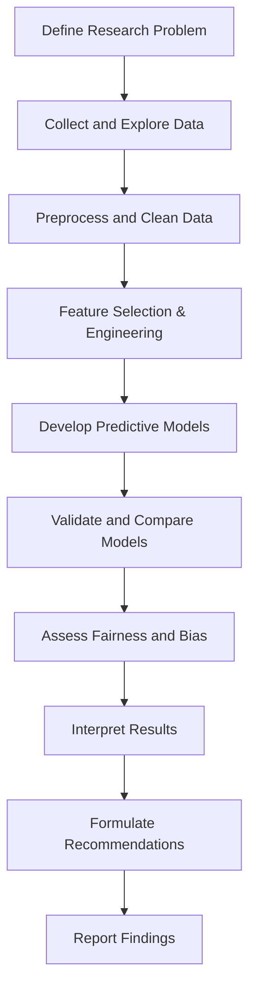

# 1.1 Define Research Problem

## Introduction

The process of loan approval is a cornerstone of the financial services industry, directly impacting the profitability of lending institutions and the financial well-being of individuals and businesses. In recent years, the increasing complexity of financial products, the diversity of applicants, and the growing volume of loan applications have posed significant challenges to traditional loan approval systems. These systems, often reliant on manual assessments and basic credit scoring, are susceptible to inefficiencies, inconsistencies, and biases. As a result, there is a pressing need to develop more robust, data-driven approaches to loan approval that can enhance decision-making, reduce risk, and promote financial inclusion.

## Statement of the Problem

Despite advances in technology, many financial institutions continue to rely on outdated methods for evaluating loan applications. These methods may:

- Fail to capture the full range of factors influencing creditworthiness
- Be prone to human error and subjective judgment
- Lack transparency and explainability
- Struggle to scale with increasing application volumes
- Exhibit unintentional bias, leading to unfair lending practices

The central research problem addressed in this project is:

**How can machine learning and statistical analysis be leveraged to develop predictive models that accurately assess loan approval likelihood, identify key factors influencing lending decisions, and ensure fairness and transparency in the process?**

## Objectives

The primary objectives of this research are:

- To identify and analyze the most significant predictors of loan approval
- To develop and validate predictive models using machine learning and statistical techniques
- To compare the effectiveness of traditional and modern approaches
- To assess the fairness and transparency of automated decision-making systems
- To provide actionable recommendations for improving loan approval processes

## Background and Rationale

Loan approval decisions have far-reaching consequences for both lenders and borrowers. For lenders, poor risk assessment can result in increased default rates and financial losses. For borrowers, unfair or opaque decisions can limit access to credit and perpetuate economic inequality. The integration of advanced analytics and machine learning offers the potential to:

- Improve the accuracy and consistency of loan approval decisions
- Reduce processing times and operational costs
- Enhance compliance with regulatory requirements
- Promote financial inclusion by identifying creditworthy applicants who may be overlooked by traditional methods

## Research Questions

1. What are the key variables that influence loan approval decisions?
2. How do machine learning models compare to traditional statistical methods in predicting loan approval?
3. What are the potential sources of bias in automated loan approval systems, and how can they be mitigated?
4. How can the transparency and explainability of predictive models be improved?
5. What are the implications of adopting data-driven loan approval systems for financial institutions and applicants?

## Scope of the Study

This research will focus on open-source loan datasets that include a variety of applicant and loan characteristics. The study will encompass:

- Data preprocessing and cleaning
- Exploratory data analysis
- Feature selection and engineering
- Model development and validation
- Fairness and bias assessment
- Policy and process recommendations

## Significance of the Study

The outcomes of this research are expected to:

- Provide a comprehensive understanding of the factors driving loan approval
- Demonstrate the potential of machine learning to enhance risk assessment
- Offer practical guidelines for implementing fair and transparent loan approval systems
- Contribute to the academic literature on financial analytics and responsible lending

## Flowchart: Loan Approval Research Process

## Conclusion

In summary, this research addresses a critical need in the financial sector for more objective, efficient, and equitable loan approval systems. By leveraging the power of data science and machine learning, the project aims to develop predictive models that not only improve decision accuracy but also promote fairness and transparency. The findings will have significant implications for both academic research and practical applications in the financial industry.
