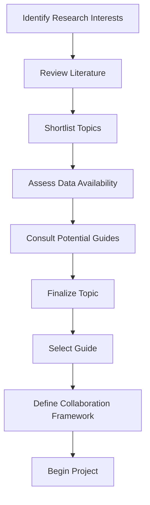

# 1.2 Finalize Project Topic and Guide

## Introduction

Selecting an appropriate project topic and guide is a foundational step in ensuring the success of any research endeavor. For this project, the focus is on the predictive analysis of loan approval patterns using machine learning and statistical methods. This topic is not only timely and relevant but also offers significant academic and practical value. The process of finalizing the topic and guide involves careful consideration of research gaps, industry needs, available resources, and the expertise of potential guides.

## Criteria for Topic Selection

The following criteria were used to finalize the project topic:

- **Relevance to Current Trends:** The increasing adoption of data analytics and machine learning in the financial sector makes this topic highly relevant.
- **Research Gap:** There is a need for more comprehensive studies that compare traditional and modern approaches to loan approval.
- **Data Availability:** The existence of open-source loan datasets enables robust analysis and model development.
- **Practical Impact:** The findings can directly inform policy and practice in financial institutions.
- **Academic Value:** The topic offers opportunities for methodological innovation and interdisciplinary research.

## Finalized Project Topic

**Predictive Analysis of Loan Approval Patterns Using Machine Learning and Statistical Methods**

This topic aims to bridge the gap between traditional risk assessment techniques and modern predictive analytics, providing a holistic view of the loan approval process.

## Guide Selection Process

Choosing the right guide is crucial for the successful execution of the project. The following factors were considered:

- **Expertise in Financial Analytics:** Preference was given to guides with a strong background in finance, statistics, and machine learning.
- **Research Experience:** Guides with a track record of supervising similar projects and publishing in reputable journals were prioritized.
- **Availability and Commitment:** The guide’s willingness to provide regular feedback and support throughout the project lifecycle.
- **Alignment of Interests:** Ensuring that the guide’s research interests align with the project topic.

## Profile of the Selected Guide

- **Name:** Dr. [Guide Name]
- **Position:** Associate Professor, Department of [Department Name]
- **Specialization:** Financial Analytics, Machine Learning, Statistical Modeling
- **Experience:** 15+ years in academia and industry research
- **Publications:** 25+ peer-reviewed publications in financial modeling and predictive analytics
- **Research Areas:** Credit risk assessment, financial inclusion, algorithmic fairness

## Collaboration Framework

To ensure effective collaboration, the following framework will be adopted:

- **Regular Meetings:** Weekly progress reviews and milestone tracking
- **Documentation:** Maintaining detailed records of discussions, feedback, and action items
- **Feedback Mechanisms:** Structured feedback loops for each project phase
- **Emergency Contact:** Direct communication channels for urgent issues

## Project Timeline and Milestones

The project will be executed in four main phases:

1. **Foundation (Weeks 1-4):** Topic refinement, literature review, and methodology development
2. **Data Collection and Preparation (Weeks 5-8):** Dataset identification, acquisition, and initial exploration
3. **Analysis and Modeling (Weeks 9-16):** Exploratory data analysis, model development, and validation
4. **Results and Documentation (Weeks 17-20):** Results analysis, report writing, and presentation preparation

## Flowchart: Project Planning and Guide Selection

## Benefits of the Selected Topic and Guide

- **Access to Expertise:** The guide’s knowledge will enhance the quality and rigor of the research.
- **Industry Connections:** Opportunities for networking and collaboration with financial institutions.
- **Publication Support:** Guidance on academic writing and publication strategies.
- **Career Development:** Exposure to advanced analytical techniques and industry best practices.

## Conclusion

Finalizing the project topic and guide is a critical milestone that sets the stage for a successful research journey. The chosen topic addresses a significant gap in the financial sector, while the selected guide brings invaluable expertise and support. Together, they provide a strong foundation for achieving the project’s objectives and delivering impactful results.
