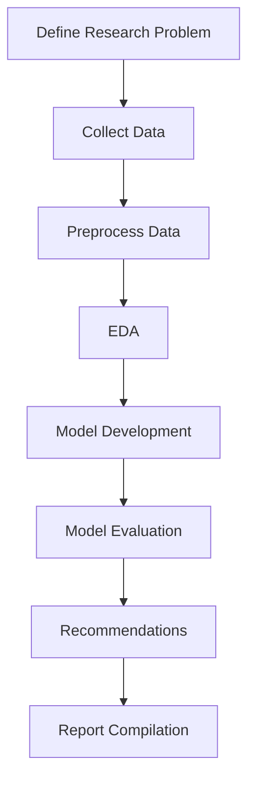

# 1.3 Prepare Project Synopsis

## Executive Summary

This project aims to develop and validate predictive models for loan approval using machine learning and statistical analysis. By leveraging open-source datasets, the research will identify key factors influencing loan approval, compare traditional and modern modeling approaches, and provide actionable recommendations for financial institutions. The project is designed to address inefficiencies, inconsistencies, and biases in current loan approval processes, ultimately promoting fairness, transparency, and financial inclusion.

## Background and Motivation

Loan approval is a critical process in the financial sector, affecting both institutional risk and individual access to credit. Traditional methods, while useful, often fall short in capturing the complexity of applicant profiles and market dynamics. The rise of data science and machine learning offers new opportunities to enhance decision-making, reduce risk, and ensure equitable access to financial services.

## Research Objectives

- **Identify significant predictors of loan approval** using statistical and machine learning techniques
- **Develop and compare predictive models** (e.g., logistic regression, decision trees, random forests)
- **Assess model performance** using accuracy, precision, recall, F1-score, and AUC
- **Evaluate fairness and transparency** in automated decision-making
- **Recommend improvements** for risk assessment and policy

## Methodology

### Data Collection
- Use open-source loan datasets (e.g., Lending Club, Kaggle, UCI Repository)
- Ensure datasets include both approved and rejected applications
- Document data sources, structure, and limitations

### Data Preprocessing
- Handle missing values and outliers
- Encode categorical variables
- Normalize or scale numeric fields
- Split data into training, validation, and test sets

### Exploratory Data Analysis (EDA)
- Generate descriptive statistics
- Visualize data distributions and relationships
- Perform cross-tabulations and outlier detection

### Model Development
- Build baseline models using traditional statistical methods
- Develop advanced models using machine learning algorithms
- Tune hyperparameters and validate models using cross-validation

### Model Evaluation
- Compare models using standard performance metrics
- Assess interpretability and explainability
- Analyze fairness across demographic groups

### Recommendations and Reporting
- Identify significant predictors and decision gaps
- Propose improved risk screening and policy changes
- Compile findings into a comprehensive report

## Flowchart: Project Research Plan

## Expected Outcomes

- Validated predictive models for loan approval
- Identification of key factors influencing lending decisions
- Comparative analysis of traditional and machine learning approaches
- Recommendations for improving risk assessment and policy
- Framework for ongoing monitoring and evaluation

## Significance

This research will contribute to both academic knowledge and practical applications in the financial sector. By demonstrating the value of data-driven decision-making, the project aims to:

- Improve the accuracy and fairness of loan approval processes
- Reduce operational costs and processing times
- Enhance compliance with regulatory standards
- Promote financial inclusion and responsible lending

## Conclusion

The project synopsis outlines a comprehensive plan for developing, validating, and implementing predictive models for loan approval. Through rigorous analysis and collaboration with academic and industry experts, the research will deliver actionable insights and practical tools for enhancing financial decision-making.
