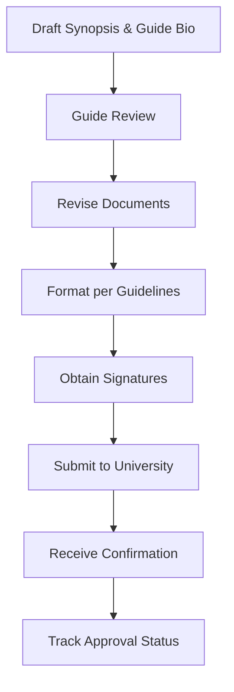

# 1.4 Submit Synopsis and Guide Bio to University

## Introduction

Submitting the project synopsis and guide bio to the university is a formal process that marks the transition from project planning to execution. This step ensures that the research proposal is reviewed, validated, and approved by academic authorities, providing a foundation for ethical and methodological rigor. The process involves preparing comprehensive documentation, effective communication with stakeholders, and adherence to institutional protocols.

## Documentation Preparation

### Project Synopsis
- Clearly articulate the research problem, objectives, and significance
- Provide a detailed methodology, including data sources and analysis plan
- Outline expected outcomes and contributions
- Include a project timeline and milestones
- Address ethical considerations and data privacy

### Guide Bio
- Academic qualifications and professional experience
- Research interests and publications
- Previous supervision and mentoring experience
- Alignment with the project topic

### Supporting Documents
- Student academic transcripts
- Letters of intent or motivation
- Institutional forms and declarations

## Communication with Stakeholders

- **Guide:** Collaborate closely to ensure the synopsis and bio accurately reflect the project scope and expertise
- **Department Head:** Seek preliminary feedback and endorsement
- **University Research Office:** Submit documents through official channels (e.g., online portal, email, or in-person)
- **Administrative Staff:** Confirm receipt and track progress

## Submission Process

1. **Drafting:** Prepare initial versions of the synopsis and guide bio
2. **Review:** Obtain feedback from the guide and revise as needed
3. **Formatting:** Ensure compliance with university guidelines (e.g., formatting, word count, required sections)
4. **Approval:** Secure signatures from the guide and department head
5. **Submission:** Upload or deliver documents to the university research office
6. **Confirmation:** Receive acknowledgment of submission and tracking number

## Flowchart: Synopsis Submission Process

## Best Practices

- Start early to allow time for revisions
- Maintain clear and open communication with all stakeholders
- Keep copies of all submitted documents and correspondence
- Follow up regularly to monitor approval status
- Be prepared to address feedback or requests for clarification

## Common Challenges and Solutions

- **Delays in Feedback:** Proactively schedule review meetings and set deadlines
- **Formatting Issues:** Use university-provided templates and checklists
- **Missing Information:** Double-check requirements and consult with administrative staff
- **Technical Issues:** Ensure access to submission portals and backup files

## Conclusion

The submission of the project synopsis and guide bio is a critical administrative milestone that ensures the research is grounded in academic standards and institutional oversight. By following a structured process and maintaining effective communication, students can facilitate a smooth and successful approval process, paving the way for the next stages of their research journey.
