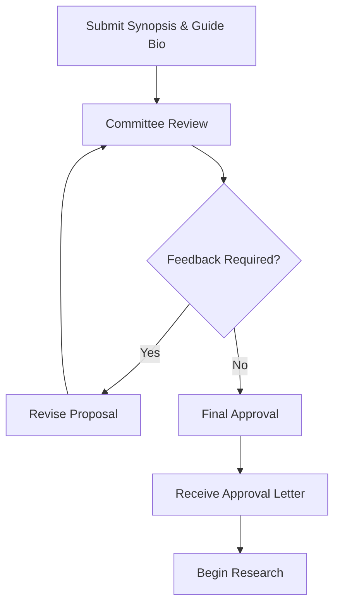

# 1.5 Receive Approval

## Introduction

Receiving formal approval for the project from the university is a pivotal milestone in the research journey. This step signifies that the proposed research has met the academic, ethical, and procedural standards set by the institution. Approval not only validates the research plan but also provides the green light to proceed with data collection, analysis, and subsequent phases. The process involves rigorous review, feedback, and compliance with institutional requirements.

## The Approval Process

### 1. Initial Review
- The submitted synopsis and guide bio are reviewed by the departmental research committee or a designated academic panel.
- The review focuses on the clarity of the research problem, feasibility of the methodology, and alignment with academic standards.
- Ethical considerations, such as data privacy and informed consent, are also evaluated.

### 2. Feedback and Revisions
- The committee may provide feedback or request clarifications on specific aspects of the proposal.
- Common feedback areas include:
  - Research objectives and scope
  - Methodological rigor
  - Data sources and quality
  - Ethical safeguards
  - Timeline and resource allocation
- The student revises the proposal based on feedback and resubmits for final review.

### 3. Final Approval
- Once all concerns are addressed, the committee grants formal approval.
- An official approval letter or certificate is issued, often signed by the department head and research office.
- The student is notified via email or the university portal.

## Flowchart: Project Approval Process

## Significance of Approval

- **Academic Validation:** Confirms that the research meets scholarly standards and contributes to the field.
- **Ethical Clearance:** Ensures that the study adheres to ethical guidelines, protecting participants and data integrity.
- **Resource Access:** Grants access to university resources, such as data repositories, software, and funding (if applicable).
- **Official Recognition:** The project is formally recognized as part of the academic program, making it eligible for evaluation and credit.
- **Motivation and Confidence:** Approval boosts the researcher's confidence and motivation to pursue the project with rigor.

## Compliance Requirements

- Adherence to the approved methodology and timeline
- Regular progress updates to the guide and department
- Immediate reporting of any deviations or challenges
- Compliance with data privacy and ethical standards throughout the project

## Next Steps After Approval

1. **Kick-off Meeting:** Schedule a meeting with the guide to discuss the approved plan and next actions.
2. **Detailed Planning:** Break down the project into actionable tasks and set internal deadlines.
3. **Data Acquisition:** Begin collecting or accessing the required datasets.
4. **Tool Setup:** Install and configure necessary software and analytical tools.
5. **Documentation:** Maintain a research journal to track progress, challenges, and insights.
6. **Regular Check-ins:** Establish a schedule for regular meetings and progress reviews.

## Best Practices

- Celebrate the milestone but remain focused on the work ahead
- Clarify any remaining doubts with the guide or committee
- Stay organized and proactive in managing tasks and deadlines
- Keep all approval documents and correspondence for future reference

## Common Challenges and Solutions

- **Delayed Feedback:** Politely follow up with the committee and seek guidance from the guide
- **Ambiguous Requirements:** Request clarification and refer to university guidelines
- **Resource Constraints:** Explore alternative resources or seek support from the department
- **Scope Creep:** Stick to the approved plan and document any necessary changes

## Conclusion

Receiving project approval is a testament to the quality and feasibility of the research proposal. It marks the official start of the research journey, providing access to resources, institutional support, and academic recognition. By adhering to the approved plan and maintaining open communication with stakeholders, researchers can navigate the subsequent phases with confidence and clarity, ultimately delivering impactful and meaningful results.
