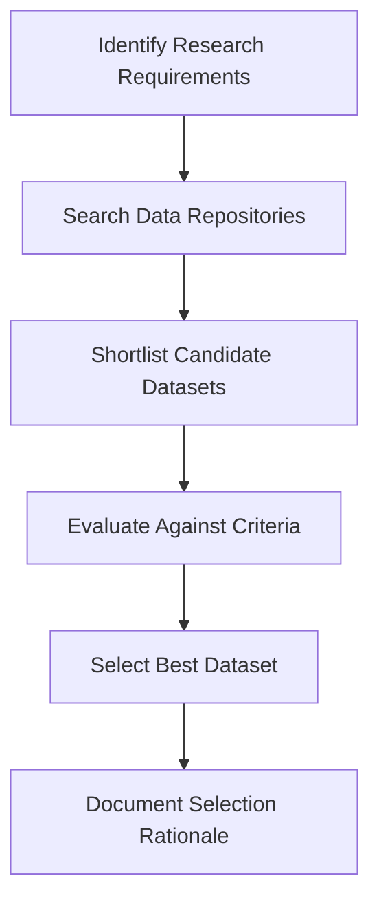

# 2.1 Select Open-Source Loan Dataset

## Introduction

The selection of an appropriate dataset is a foundational step in any data-driven research project. For a loan approval prediction project, the dataset must be comprehensive, relevant, and representative of real-world lending scenarios. The quality and suitability of the dataset directly influence the validity and generalizability of the research findings. This section details the process of identifying, evaluating, and selecting an open-source loan dataset for the project.

## Criteria for Dataset Selection

When selecting a dataset for loan approval prediction, the following criteria are essential:

- **Relevance:** The dataset should pertain to loan applications, including both approved and rejected cases.
- **Comprehensiveness:** It should contain a wide range of variables, such as applicant demographics, financial history, loan characteristics, and outcomes.
- **Data Quality:** The dataset must have minimal missing values, errors, or inconsistencies.
- **Size:** A sufficiently large dataset is necessary to ensure robust model training and validation.
- **Public Availability:** The dataset should be open-source, allowing unrestricted access for academic research.
- **Documentation:** Comprehensive documentation and data dictionaries are crucial for understanding variable definitions and data structure.
- **Ethical Compliance:** The dataset must be anonymized to protect the privacy of individuals.

## Potential Data Sources

Several open-source repositories provide datasets suitable for loan approval prediction:

- **Kaggle:** Offers a variety of loan datasets, including the popular "Loan Prediction Problem" dataset, which contains information on loan applications, applicant details, and approval status.
- **UCI Machine Learning Repository:** Hosts datasets such as the "Statlog (German Credit Data)" and "Give Me Some Credit," which are widely used in credit risk modeling research.
- **Lending Club:** Provides a comprehensive dataset of peer-to-peer loan applications, including detailed borrower information and loan performance.
- **OpenML:** Features datasets contributed by the machine learning community, including financial and credit-related data.
- **Government Portals:** Some government agencies release anonymized loan and credit datasets for research purposes.

## Evaluation of Candidate Datasets

Each potential dataset is evaluated based on the selection criteria:

### 1. Kaggle Loan Prediction Dataset
- Contains 600+ loan applications with detailed applicant and loan information
- Includes both categorical and numerical variables
- Well-documented and widely used in academic projects
- Limitations: Moderate size, some missing values

### 2. Lending Club Loan Data
- Over 2 million records of peer-to-peer loans
- Rich in features: employment, income, credit history, loan purpose, etc.
- Updated regularly and includes loan performance outcomes
- Limitations: Large size may require significant preprocessing; U.S.-centric

### 3. UCI Statlog (German Credit Data)
- 1000 records with 20 attributes
- Focuses on credit risk classification
- Well-structured and easy to use
- Limitations: Smaller size, limited demographic diversity

### 4. OpenML Credit Datasets
- Various datasets with different structures and sizes
- Community-driven, with collaborative features
- Limitations: Varying quality and documentation

## Justification for Selected Dataset

After careful evaluation, the **Lending Club Loan Data** is selected for the following reasons:

- **Comprehensiveness:** Offers a wide range of variables, enabling in-depth analysis and feature engineering
- **Size:** Large enough to support robust model development and validation
- **Realism:** Reflects real-world lending scenarios and outcomes
- **Documentation:** Well-documented with data dictionaries and user guides
- **Community Support:** Widely used in research, with available benchmarks and code examples

## Flowchart: Dataset Selection Process

## Ethical Considerations

- Ensure all data is anonymized and used in compliance with privacy regulations
- Avoid using personally identifiable information (PII)
- Acknowledge data sources and respect licensing terms

## Conclusion

The selection of the Lending Club Loan Data as the primary dataset provides a strong foundation for the loan approval prediction project. Its comprehensiveness, size, and real-world relevance ensure that the research findings will be robust, generalizable, and valuable to both academic and industry stakeholders.
