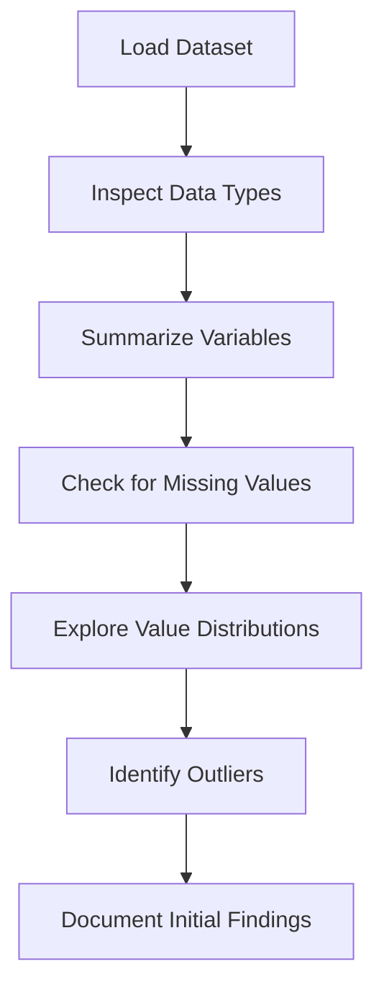

# 2.2 Explore Dataset Structure and Format

## Introduction

Understanding the structure and format of the selected loan dataset is a critical step in the data science workflow. Before any analysis or modeling can begin, it is essential to thoroughly explore the dataset, identify its components, and assess its suitability for the research objectives. This section provides a comprehensive overview of the dataset’s structure, variable types, and initial observations.

## Dataset Overview

The Lending Club Loan Data, selected for this project, is a rich and complex dataset containing millions of records and dozens of variables. The dataset is typically provided in CSV format, making it accessible for analysis using a variety of tools such as Python, R, and spreadsheet software.

### Key Features of the Dataset

- **Format:** CSV (Comma-Separated Values)
- **Records:** Over 2 million loan applications
- **Variables:** 100+ features, including applicant demographics, financial history, loan characteristics, and outcomes
- **Time Span:** Multiple years, allowing for temporal analysis
- **Documentation:** Accompanied by a comprehensive data dictionary

## Data Types and Variable Categories

The dataset includes a mix of data types and variable categories:

- **Numerical Variables:** Loan amount, annual income, interest rate, installment, debt-to-income ratio, etc.
- **Categorical Variables:** Loan purpose, home ownership status, employment title, loan grade, etc.
- **Date/Time Variables:** Issue date, last payment date, earliest credit line, etc.
- **Boolean Variables:** Indicators such as loan default status, late payment, etc.

## Variable Overview

Some of the most important variables in the dataset include:

- **loan_amnt:** The total amount of money requested by the applicant
- **term:** The number of months over which the loan is to be repaid
- **int_rate:** The interest rate on the loan
- **installment:** The monthly payment owed by the borrower
- **grade:** Loan grade assigned by the platform (A-G)
- **sub_grade:** More granular loan grade
- **emp_title:** Job title of the applicant
- **emp_length:** Number of years the applicant has been employed
- **home_ownership:** Home ownership status (e.g., RENT, OWN, MORTGAGE)
- **annual_inc:** Annual income of the applicant
- **purpose:** The purpose of the loan (e.g., debt consolidation, credit card, home improvement)
- **addr_state:** State of residence
- **dti:** Debt-to-income ratio
- **delinq_2yrs:** Number of delinquencies in the past 2 years
- **revol_util:** Revolving line utilization rate
- **total_acc:** Total number of credit lines
- **application_type:** Individual or joint application
- **loan_status:** Outcome of the loan (e.g., Fully Paid, Charged Off, Default)

## Flowchart: Dataset Exploration Process

## Initial Data Exploration Steps

1. **Loading the Data:** Import the CSV file into a data analysis environment (e.g., pandas in Python)
2. **Inspecting Data Types:** Use functions like `info()` and `dtypes` to check variable types
3. **Summarizing Variables:** Generate summary statistics for numerical and categorical variables
4. **Checking for Missing Values:** Identify variables with missing or null values
5. **Exploring Value Distributions:** Visualize distributions using histograms, boxplots, and bar charts
6. **Identifying Outliers:** Use statistical methods and visualizations to detect anomalies
7. **Documenting Findings:** Record observations and potential issues for further analysis

## Common Data Quality Issues

- **Missing Values:** Some variables may have significant proportions of missing data
- **Inconsistent Formats:** Variations in date formats, categorical labels, etc.
- **Outliers:** Extreme values that may skew analysis
- **Duplicate Records:** Multiple entries for the same applicant or loan

## Initial Findings

- The dataset is comprehensive but requires significant preprocessing
- Certain variables, such as employment title and home ownership, have high cardinality
- Some variables are highly correlated (e.g., loan amount and installment)
- The target variable (loan_status) is imbalanced, with more approved than rejected loans

## Conclusion

A thorough exploration of the dataset’s structure and format lays the groundwork for effective data preprocessing and analysis. By understanding the types and distributions of variables, researchers can make informed decisions about feature selection, data cleaning, and modeling strategies, ultimately enhancing the quality and reliability of the research outcomes.
