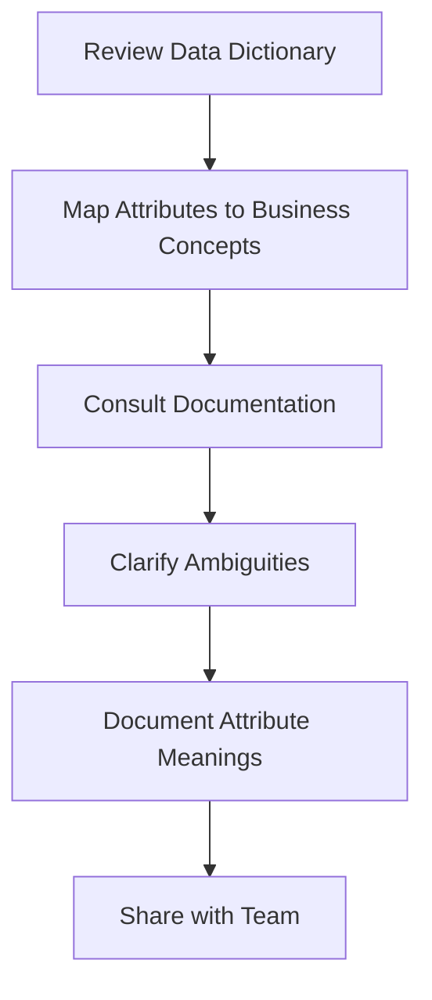

# 2.3 Understand Attribute Definitions

## Introduction

A clear understanding of attribute definitions is essential for any data-driven project. In the context of loan approval prediction, each variable in the dataset represents a specific aspect of the applicant, loan, or outcome. Misinterpreting these attributes can lead to incorrect analysis, flawed models, and misleading conclusions. This section provides a comprehensive guide to understanding, interpreting, and documenting the key attributes in the selected loan dataset.

## Importance of Attribute Definitions

- **Accurate Analysis:** Ensures that variables are used correctly in statistical and machine learning models
- **Feature Engineering:** Facilitates the creation of new features and the transformation of existing ones
- **Interpretability:** Enhances the ability to explain model predictions to stakeholders
- **Reproducibility:** Supports clear documentation and sharing of research findings

## Key Attribute Categories

### 1. Applicant Demographics
- **emp_title:** Job title of the applicant
- **emp_length:** Number of years employed
- **home_ownership:** Home ownership status (e.g., RENT, OWN, MORTGAGE)
- **annual_inc:** Annual income
- **addr_state:** State of residence
- **application_type:** Individual or joint application

### 2. Loan Characteristics
- **loan_amnt:** Amount requested by the applicant
- **term:** Repayment period (e.g., 36 or 60 months)
- **int_rate:** Interest rate assigned to the loan
- **installment:** Monthly payment amount
- **grade/sub_grade:** Credit grade assigned by the platform
- **purpose:** Reason for the loan (e.g., debt consolidation, home improvement)

### 3. Credit History
- **dti:** Debt-to-income ratio
- **delinq_2yrs:** Number of delinquencies in the past 2 years
- **revol_util:** Utilization rate of revolving credit lines
- **total_acc:** Total number of credit accounts
- **earliest_cr_line:** Date of the earliest credit line

### 4. Loan Outcome
- **loan_status:** Final status of the loan (e.g., Fully Paid, Charged Off, Default)
- **recoveries:** Amount recovered after default
- **last_pymnt_d:** Date of last payment

## Flowchart: Attribute Understanding Process

## Attribute Documentation

For each attribute, it is important to document:
- **Name:** The variable name in the dataset
- **Type:** Numerical, categorical, date, or boolean
- **Description:** What the variable represents
- **Possible Values:** Range or categories
- **Source:** How the data was collected or derived
- **Importance:** Relevance to loan approval prediction

### Example Attribute Documentation

| Name         | Type       | Description                                 | Possible Values           | Importance                |
|--------------|------------|---------------------------------------------|--------------------------|---------------------------|
| loan_amnt    | Numerical  | Amount requested by applicant               | 1000-40000               | High                      |
| term         | Categorical| Repayment period                            | 36, 60 months            | Medium                    |
| int_rate     | Numerical  | Interest rate assigned                      | 5%-30%                   | High                      |
| emp_length   | Categorical| Years employed                              | 0-10+                    | Medium                    |
| home_ownership| Categorical| Home ownership status                      | RENT, OWN, MORTGAGE      | Medium                    |
| dti          | Numerical  | Debt-to-income ratio                        | 0-50                     | High                      |
| loan_status  | Categorical| Final status of the loan                    | Fully Paid, Default, etc.| Target variable           |

## Common Attribute Challenges

- **Ambiguous Definitions:** Some variables may have unclear or overlapping meanings
- **Derived Variables:** Attributes created from other variables may require additional explanation
- **Changing Definitions:** Variable meanings may evolve over time or across datasets
- **Missing Documentation:** Not all datasets provide comprehensive data dictionaries

## Best Practices

- Always refer to the official data dictionary and documentation
- Consult with domain experts or data providers for clarification
- Document any assumptions or interpretations made during analysis
- Update documentation as new insights are gained

## Conclusion

A thorough understanding of attribute definitions is vital for accurate analysis, effective modeling, and clear communication of results. By systematically documenting and interpreting each variable, researchers can ensure the integrity and reproducibility of their work, ultimately leading to more reliable and actionable insights in loan approval prediction.
