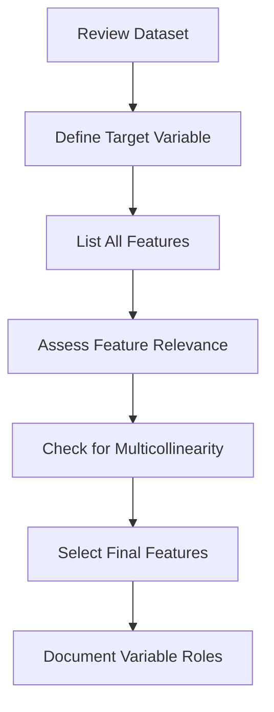

# 2.4 Identify Dependent and Independent Variables

## Introduction

Identifying dependent and independent variables is a crucial step in the data analysis process. In the context of loan approval prediction, this involves distinguishing between the target variable (what we want to predict) and the features (variables used to make the prediction). Proper identification and selection of variables directly impact the performance and interpretability of predictive models.

## Dependent Variable (Target)

The dependent variable, also known as the target or outcome variable, is the main focus of prediction. For loan approval projects, the typical target variable is:

- **loan_status:** Indicates whether a loan application was approved, fully paid, charged off, or defaulted. For binary classification, this is often recoded as Approved (1) or Not Approved (0).

### Characteristics of a Good Target Variable
- Clearly defined and unambiguous
- Sufficiently represented in the dataset (not too imbalanced)
- Directly related to the research question
- Consistent across all records

## Independent Variables (Features)

Independent variables, or features, are the predictors used to estimate the target variable. In loan approval prediction, these include:

- **Applicant Demographics:** Age, employment length, home ownership, annual income, state, etc.
- **Loan Characteristics:** Loan amount, term, interest rate, installment, grade, purpose, etc.
- **Credit History:** Debt-to-income ratio, delinquencies, revolving utilization, total accounts, earliest credit line, etc.
- **Application Type:** Individual or joint application

### Criteria for Feature Selection
- Relevance to the target variable
- Low multicollinearity (features should not be highly correlated with each other)
- Availability and completeness (few missing values)
- Interpretability and business significance

## Flowchart: Variable Identification Process

## Feature Importance and Selection Techniques

- **Correlation Analysis:** Identify features strongly correlated with the target
- **Statistical Tests:** Use chi-square, ANOVA, or t-tests for categorical/numerical features
- **Feature Engineering:** Create new features or transform existing ones for better predictive power
- **Model-Based Selection:** Use algorithms (e.g., Random Forest, Lasso) to rank feature importance
- **Domain Knowledge:** Leverage business understanding to prioritize features

## Example: Variable Roles in Loan Approval Prediction

| Variable         | Type         | Role                |
|------------------|--------------|---------------------|
| loan_status      | Categorical  | Dependent (Target)  |
| loan_amnt        | Numerical    | Independent         |
| int_rate         | Numerical    | Independent         |
| emp_length       | Categorical  | Independent         |
| home_ownership   | Categorical  | Independent         |
| dti              | Numerical    | Independent         |
| purpose          | Categorical  | Independent         |
| annual_inc       | Numerical    | Independent         |
| grade            | Categorical  | Independent         |
| delinq_2yrs      | Numerical    | Independent         |

## Challenges in Variable Identification

- **Imbalanced Target:** If the target variable is highly imbalanced, model performance may suffer
- **Redundant Features:** Highly correlated features can introduce noise
- **Irrelevant Features:** Including too many irrelevant features can reduce model accuracy
- **Missing Data:** Features with many missing values may need to be excluded or imputed

## Best Practices

- Start with a broad set of features, then narrow down using statistical and domain-driven methods
- Regularly revisit feature selection as new insights are gained
- Document all decisions and rationale for variable inclusion/exclusion

## Conclusion

Accurate identification of dependent and independent variables is foundational to building effective predictive models. By systematically selecting and documenting variable roles, researchers can enhance model performance, interpretability, and the overall quality of the loan approval prediction project.
