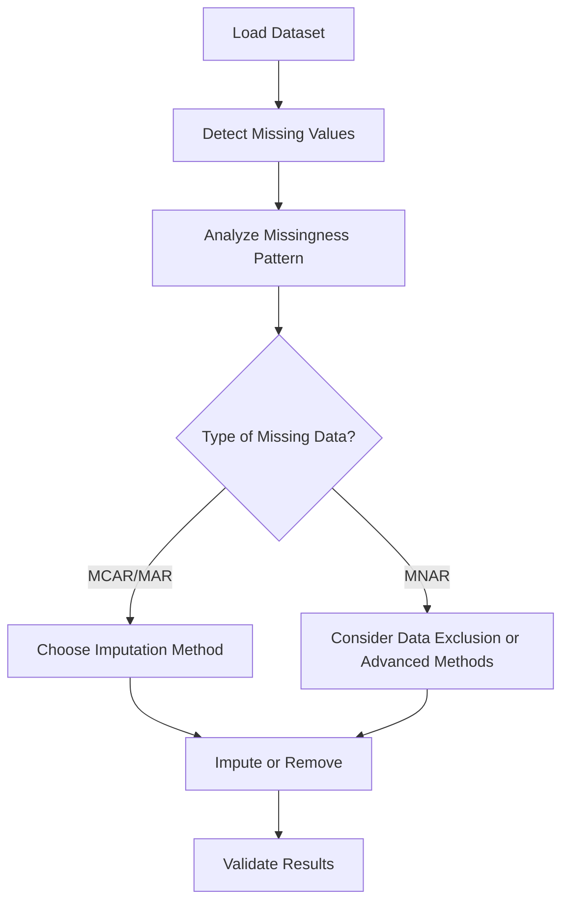

# 3.1 Handle Missing Values

## Introduction

Missing values are a common challenge in real-world datasets, especially in financial and loan application data. Properly handling missing data is crucial for ensuring the accuracy, reliability, and validity of any predictive model. This section explores the types of missing data, methods for detecting and handling missing values, and best practices for imputation in the context of loan approval prediction.

## Types of Missing Data

Understanding the nature of missing data is the first step in addressing it effectively. There are three main types:

- **Missing Completely at Random (MCAR):** The missingness is unrelated to any variable in the dataset.
- **Missing at Random (MAR):** The missingness is related to observed data but not the missing data itself.
- **Missing Not at Random (MNAR):** The missingness is related to the value of the missing data itself.

## Detection of Missing Values

### Common Techniques
- **Summary Statistics:** Use functions like `isnull()`, `sum()`, and `info()` in Python (pandas) to identify missing values.
- **Visualization:** Heatmaps, bar charts, and matrix plots can visually highlight missing data patterns.
- **Pattern Analysis:** Examine if missingness is concentrated in specific variables or records.

## Flowchart: Handling Missing Values

## Methods for Handling Missing Values

### 1. Deletion
- **Listwise Deletion:** Remove entire records with missing values. Suitable when missingness is minimal and random.
- **Pairwise Deletion:** Use available data for each analysis, ignoring missing values only in relevant variables.

### 2. Imputation
- **Mean/Median/Mode Imputation:** Replace missing values with the mean, median, or mode of the variable. Simple but may distort distributions.
- **Constant Imputation:** Fill missing values with a fixed value (e.g., -1 or 'Unknown'). Useful for categorical variables.
- **Forward/Backward Fill:** Use previous or next valid observation to fill missing values (time series data).
- **K-Nearest Neighbors (KNN) Imputation:** Use values from similar records to estimate missing values.
- **Regression Imputation:** Predict missing values using regression models based on other variables.
- **Multiple Imputation:** Create several imputed datasets and combine results for robust analysis.

### 3. Advanced Techniques
- **Machine Learning Models:** Use algorithms like Random Forests to predict missing values.
- **Domain-Specific Methods:** Apply business rules or expert knowledge for imputation.

## Best Practices

- **Assess Impact:** Evaluate how missing data affects model performance and results.
- **Document Decisions:** Record all imputation methods and rationale for transparency.
- **Avoid Over-Imputation:** Excessive imputation can introduce bias; use only when necessary.
- **Validate Results:** Compare imputed data with original distributions and check for inconsistencies.
- **Iterative Approach:** Revisit imputation strategies as new insights are gained during analysis.

## Common Challenges

- **High Proportion of Missing Data:** May require variable exclusion or advanced imputation.
- **Non-Random Missingness:** Can bias results if not properly addressed.
- **Imputation of Categorical Variables:** Requires careful selection of appropriate methods.

## Conclusion

Handling missing values is a critical preprocessing step that directly impacts the quality of predictive models. By systematically detecting, analyzing, and imputing missing data, researchers can ensure that their loan approval prediction models are robust, reliable, and generalizable.
