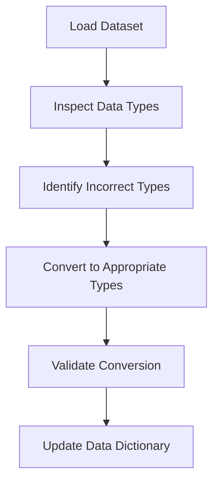

# 3.3 Convert Data Types Appropriately

## Introduction

Data type conversion is a fundamental aspect of data preprocessing. In loan approval prediction projects, datasets often contain variables of various types—numerical, categorical, date/time, and boolean. Ensuring that each variable is stored in the correct data type is essential for accurate analysis, efficient computation, and successful model training. This section discusses common data type issues, conversion methods, and best practices for handling data types in loan datasets.

## Common Data Type Issues

- **Incorrect Data Types:** Variables stored as strings instead of numbers or dates
- **Mixed Types:** Columns containing a mix of numbers and text
- **Date/Time Parsing:** Dates stored as text, requiring conversion to datetime objects
- **Boolean Representation:** True/False values stored as 0/1, Yes/No, or other formats
- **Categorical Variables:** Categories stored as text instead of categorical data types

## Flowchart: Data Type Conversion Process

## Conversion Methods

### 1. Numerical Conversion
- Use functions like `astype(float)` or `astype(int)` in Python (pandas) to convert strings to numbers
- Handle non-numeric values (e.g., 'N/A', '-') by replacing or removing them before conversion

### 2. Categorical Conversion
- Convert text categories to categorical data types for memory efficiency and faster computation
- Use `astype('category')` in pandas

### 3. Date/Time Conversion
- Parse date strings using `pd.to_datetime()` in pandas
- Extract features such as year, month, or day for analysis

### 4. Boolean Conversion
- Map values like 'Yes'/'No', 'True'/'False', or 0/1 to boolean data types
- Use `astype(bool)` or custom mapping functions

### 5. Handling Mixed Types
- Identify columns with mixed types and standardize to a single type
- Use regular expressions or custom functions to clean and convert values

## Best Practices

- **Inspect Data Types Early:** Check data types immediately after loading the dataset
- **Automate Conversion:** Use scripts to automate repetitive conversion tasks
- **Handle Errors Gracefully:** Use error handling to catch and address conversion issues
- **Document Changes:** Update the data dictionary to reflect any changes in data types
- **Validate Results:** Ensure that conversions have not introduced errors or inconsistencies
- **Leverage Libraries:** Use robust libraries (e.g., pandas, numpy) for efficient data type handling

## Common Challenges

- **Inconsistent Formats:** Variations in date or number formats across records
- **Missing or Invalid Values:** Non-convertible values that require cleaning
- **Large Datasets:** Efficiently converting data types in large datasets can be resource-intensive

## Conclusion

Appropriate data type conversion is essential for accurate, efficient, and reliable data analysis. By systematically inspecting, converting, and validating data types, researchers can ensure that their loan approval prediction models are built on a solid foundation, minimizing errors and maximizing predictive performance.
