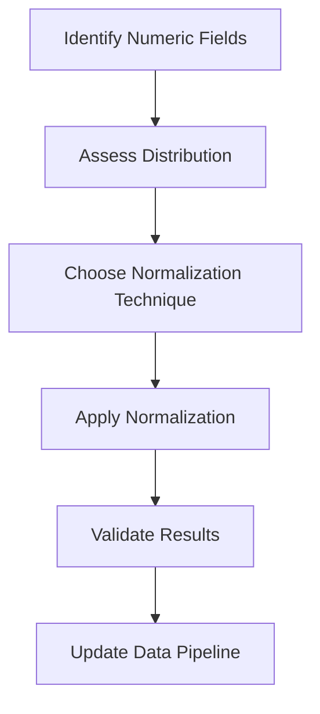

# 3.4 Normalize or Scale Numeric Fields

## Introduction

Normalization and scaling of numeric fields are essential preprocessing steps in machine learning projects, especially when working with loan datasets that contain variables with different units, ranges, and distributions. Proper normalization ensures that all features contribute equally to model training, prevents bias toward variables with larger scales, and can improve the convergence and performance of many algorithms. This section explores normalization techniques, their applications, and best practices for scaling numeric data in loan approval prediction.

## Why Normalize or Scale Data?

- **Equal Contribution:** Ensures that all features have a comparable impact on model training
- **Algorithm Requirements:** Some algorithms (e.g., k-nearest neighbors, neural networks) are sensitive to feature scales
- **Improved Convergence:** Gradient-based algorithms converge faster with normalized data
- **Outlier Mitigation:** Scaling can reduce the influence of extreme values

## Flowchart: Data Normalization Process

## Normalization Techniques

### 1. Min-Max Scaling
- Rescales values to a fixed range, usually [0, 1]
- Formula: (x - min) / (max - min)
- Sensitive to outliers

### 2. Standardization (Z-score Normalization)
- Centers data around the mean with unit variance
- Formula: (x - mean) / standard deviation
- Less sensitive to outliers than min-max scaling

### 3. Robust Scaling
- Uses median and interquartile range (IQR) for scaling
- Formula: (x - median) / IQR
- Effective for data with outliers

### 4. Log Transformation
- Applies logarithm to skewed data to reduce skewness
- Useful for variables like income or loan amount

### 5. Decimal Scaling
- Moves the decimal point of values to bring them into a standard range
- Rarely used but can be effective for certain datasets

## When to Normalize or Scale

- **Before Distance-Based Algorithms:** k-nearest neighbors, k-means clustering
- **Before Gradient-Based Algorithms:** Neural networks, logistic regression
- **When Features Have Different Units:** E.g., income (dollars) vs. age (years)
- **When Data is Skewed:** Apply log or robust scaling

## Best Practices

- **Assess Distributions:** Visualize data to choose the most appropriate scaling method
- **Avoid Data Leakage:** Fit scaling parameters on training data only, then apply to test data
- **Document Transformations:** Record all normalization steps for reproducibility
- **Combine with Other Preprocessing:** Integrate normalization into the overall data pipeline
- **Validate Results:** Check that scaling has not distorted relationships or introduced errors

## Common Challenges

- **Outliers:** Can disproportionately affect min-max scaling
- **Interpretability:** Scaled data may be less interpretable; keep original values for reporting
- **Pipeline Integration:** Ensure scaling is consistently applied during model deployment

## Conclusion

Normalization and scaling are vital for building robust, accurate, and efficient predictive models. By carefully selecting and applying appropriate techniques, researchers can ensure that their loan approval prediction models are not only effective but also generalizable to new data.
