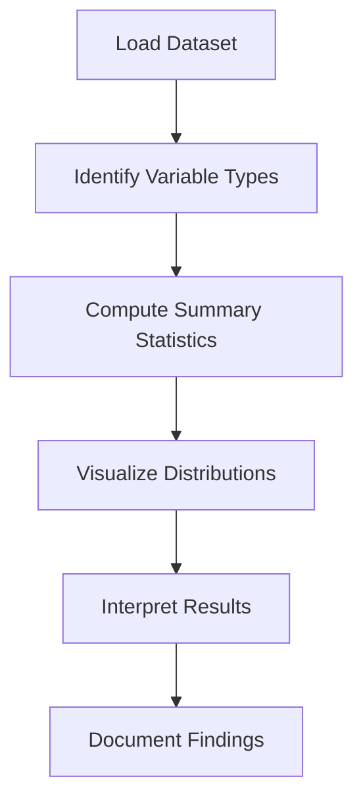

# 4.1 Generate Descriptive Statistics

## Introduction

Descriptive statistics are the foundation of exploratory data analysis (EDA). They provide a summary of the main features of a dataset, offering insights into the distribution, central tendency, variability, and relationships among variables. In the context of loan approval prediction, descriptive statistics help researchers understand applicant demographics, loan characteristics, and credit history, setting the stage for deeper analysis and modeling.

## Key Descriptive Statistics

- **Measures of Central Tendency:** Mean, median, and mode
- **Measures of Dispersion:** Standard deviation, variance, range, interquartile range (IQR)
- **Distribution Shape:** Skewness and kurtosis
- **Frequency Counts:** For categorical variables
- **Percentiles and Quartiles:** For understanding data spread

## Flowchart: Descriptive Statistics Process

## Generating Descriptive Statistics

### 1. Numerical Variables
- **Mean:** Average value (e.g., average loan amount)
- **Median:** Middle value, robust to outliers
- **Mode:** Most frequent value
- **Standard Deviation/Variance:** Measure of spread
- **Min/Max:** Range of values
- **Quartiles/IQR:** Spread of the middle 50% of data
- **Skewness/Kurtosis:** Shape of the distribution

### 2. Categorical Variables
- **Frequency Counts:** Number of occurrences for each category (e.g., loan purpose, home ownership)
- **Mode:** Most common category
- **Proportions/Percentages:** Share of each category in the dataset

### 3. Cross-Tabulations
- Compare distributions across groups (e.g., loan approval by employment status)

## Tools and Techniques

- **Python (pandas):** `describe()`, `value_counts()`, `groupby()`, `crosstab()`
- **R:** `summary()`, `table()`, `aggregate()`
- **Visualization:** Histograms, boxplots, bar charts, pie charts

## Interpretation of Results

- **Central Tendency:** Are most applicants requesting similar loan amounts?
- **Dispersion:** Is there a wide range of incomes or loan terms?
- **Distribution Shape:** Are variables skewed (e.g., income, loan amount)?
- **Category Dominance:** Are certain loan purposes or grades more common?
- **Group Differences:** Do approval rates differ by demographic or loan characteristics?

## Best Practices

- **Check for Outliers:** Extreme values can distort summary statistics
- **Visualize Distributions:** Plots reveal patterns not obvious in numbers
- **Segment Analysis:** Break down statistics by key groups (e.g., approved vs. rejected)
- **Document Everything:** Record all findings and interpretations

## Common Challenges

- **Imbalanced Data:** Some categories may dominate, skewing results
- **Missing Values:** Can affect calculation of statistics
- **High Cardinality:** Too many categories can complicate interpretation

## Conclusion

Descriptive statistics provide a comprehensive overview of the dataset, highlighting key patterns and potential issues. By systematically summarizing and interpreting the data, researchers can make informed decisions about feature selection, data cleaning, and modeling strategies, ultimately improving the quality and reliability of loan approval predictions.
