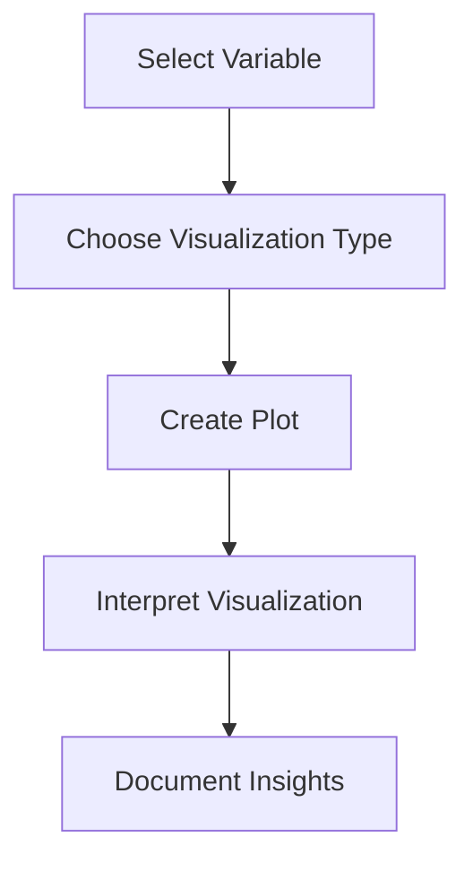

# 4.2 Create Bar Charts, Histograms, Pie Charts

## Introduction

Data visualization is a powerful tool in exploratory data analysis (EDA), enabling researchers to uncover patterns, trends, and anomalies that may not be apparent from summary statistics alone. In loan approval prediction projects, visualizations such as bar charts, histograms, and pie charts help communicate the distribution of variables, relationships between features, and differences across groups. This section explores the types of visualizations, their applications, and best practices for effective data visualization.

## Types of Visualizations

### 1. Bar Charts
- Used for categorical variables
- Show frequency or proportion of each category (e.g., loan purpose, home ownership)
- Useful for comparing groups

### 2. Histograms
- Used for numerical variables
- Show the distribution of values (e.g., loan amount, annual income)
- Reveal skewness, modality, and outliers

### 3. Pie Charts
- Used for categorical variables with few categories
- Show the proportion of each category as a slice of the whole
- Best for illustrating simple part-to-whole relationships

## Flowchart: Data Visualization Process

## Creating Visualizations

### Bar Charts
- Use for variables like loan purpose, grade, or home ownership
- X-axis: Categories; Y-axis: Frequency or percentage
- Grouped or stacked bar charts for comparisons (e.g., approval by purpose)

### Histograms
- Use for variables like loan amount, income, or debt-to-income ratio
- X-axis: Value bins; Y-axis: Frequency
- Overlay with density plots for deeper insights

### Pie Charts
- Use for variables with a small number of categories (e.g., application type)
- Each slice represents a category’s proportion
- Avoid for variables with many categories

## Tools and Libraries

- **Python:** matplotlib, seaborn, plotly
- **R:** ggplot2, base plotting functions
- **Spreadsheet Software:** Excel, Google Sheets

## Interpretation of Visualizations

- **Bar Charts:** Which categories are most/least common? Are there imbalances?
- **Histograms:** Is the distribution normal, skewed, or bimodal? Are there outliers?
- **Pie Charts:** What is the share of each category?
- **Comparisons:** How do distributions differ by approval status or other groups?

## Best Practices

- **Choose the Right Chart:** Match the visualization to the variable type and analysis goal
- **Label Clearly:** Axes, titles, and legends should be descriptive
- **Avoid Clutter:** Too many categories or colors can confuse the viewer
- **Use Color Wisely:** Highlight key differences or groups
- **Document Insights:** Record interpretations and implications for modeling

## Common Challenges

- **Overplotting:** Too many categories or data points can obscure patterns
- **Misleading Scales:** Inconsistent or truncated axes can distort interpretation
- **Color Blindness:** Use color palettes accessible to all viewers

## Conclusion

Effective data visualization is essential for understanding and communicating the structure of loan datasets. By selecting appropriate chart types and following best practices, researchers can gain valuable insights, identify potential issues, and make informed decisions throughout the loan approval prediction process.
