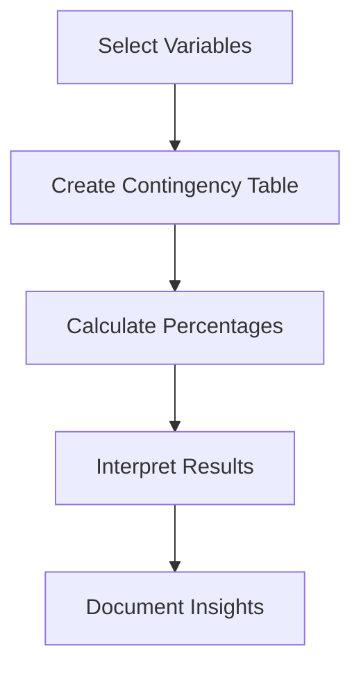

# 4.3 Perform Cross-Tabulations

## Introduction

Cross-tabulation, also known as contingency table analysis, is a statistical tool used to examine the relationship between two or more categorical variables. In loan approval prediction projects, cross-tabulations help uncover associations between applicant characteristics, loan features, and approval outcomes. This section explores the methods, interpretation, and best practices for performing cross-tabulations in the context of loan data analysis.

## What is Cross-Tabulation?

- A matrix that displays the frequency distribution of variables
- Rows and columns represent different categories
- Cells show the count or percentage of observations for each combination

## Flowchart: Cross-Tabulation Process

## Methods for Cross-Tabulation

### 1. Simple Cross-Tabulation
- Two variables (e.g., loan approval by home ownership)
- Use `pd.crosstab()` in Python or `table()` in R

### 2. Multi-Dimensional Cross-Tabulation
- More than two variables (e.g., approval by purpose and employment status)
- Use multi-index tables or pivot tables

### 3. Percentage Tables
- Convert counts to row, column, or total percentages for easier interpretation

### 4. Chi-Square Test
- Assess statistical significance of associations
- Use `scipy.stats.chi2_contingency()` in Python

## Interpretation of Results

- **Association:** Are certain categories more likely to be approved?
- **Imbalance:** Are some groups under- or over-represented?
- **Patterns:** Do approval rates differ by demographic or loan characteristics?
- **Statistical Significance:** Are observed differences likely due to chance?

## Best Practices

- **Choose Relevant Variables:** Focus on variables with business or predictive significance
- **Visualize Results:** Use heatmaps or mosaic plots for large tables
- **Check for Sparsity:** Avoid tables with too many empty or low-count cells
- **Document Findings:** Record all insights and implications for modeling

## Common Challenges

- **High Cardinality:** Too many categories can make tables unwieldy
- **Sparse Data:** Low counts in some cells can affect reliability
- **Multiple Comparisons:** Adjust for multiple testing when analyzing many tables

## Conclusion

Cross-tabulation is a powerful technique for exploring relationships in loan datasets. By systematically analyzing associations between variables, researchers can identify key predictors, detect potential biases, and inform feature selection for predictive modeling.
