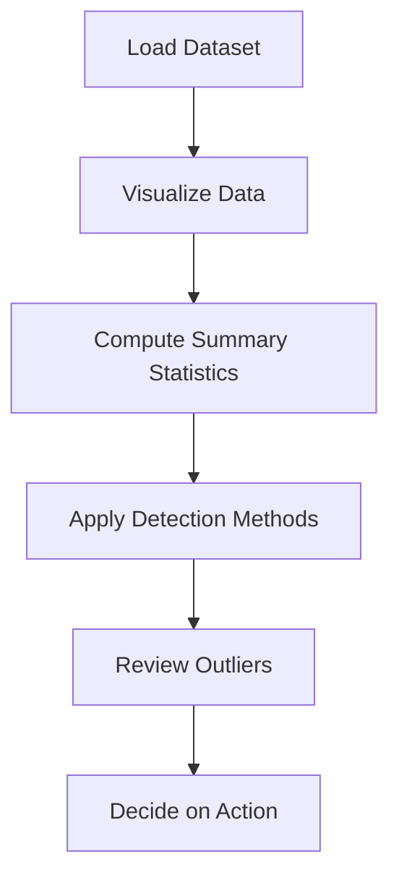

# 4.4 Detect and Review Outliers

## Introduction

Outliers are data points that deviate significantly from the majority of observations in a dataset. In loan approval prediction projects, outliers can arise from data entry errors, rare events, or genuine but extreme cases. Detecting and reviewing outliers is essential for ensuring data quality, improving model performance, and drawing valid conclusions. This section explores methods for outlier detection, their impact, and best practices for handling outliers in loan datasets.

## What are Outliers?

- Observations that fall far outside the typical range of values
- Can be univariate (extreme in one variable) or multivariate (extreme in combination of variables)
- May indicate errors, rare events, or important business cases

## Flowchart: Outlier Detection Process

## Methods for Outlier Detection

### 1. Visual Methods
- **Boxplots:** Identify values outside the whiskers
- **Histograms:** Reveal extreme values in distributions
- **Scatter Plots:** Show outliers in bivariate relationships

### 2. Statistical Methods
- **Z-Score:** Values with |z| > 3 are potential outliers
- **IQR Method:** Values below Q1 - 1.5*IQR or above Q3 + 1.5*IQR
- **Modified Z-Score:** Robust to non-normal distributions

### 3. Model-Based Methods
- **Isolation Forest:** Machine learning algorithm for anomaly detection
- **DBSCAN:** Clustering algorithm that identifies noise points

## Impact of Outliers

- **Model Performance:** Can skew parameter estimates and reduce accuracy
- **Data Quality:** May indicate errors or inconsistencies
- **Business Insights:** Sometimes represent important cases (e.g., high-value loans)

## Best Practices

- **Investigate Causes:** Determine if outliers are errors, rare events, or valid cases
- **Document Decisions:** Record rationale for removing or retaining outliers
- **Use Robust Methods:** Some models (e.g., tree-based) are less sensitive to outliers
- **Transform Data:** Apply log or robust scaling to reduce outlier impact
- **Segment Analysis:** Analyze outliers separately if they represent a meaningful group

## Common Challenges

- **High-Dimensional Data:** Outliers may not be apparent in individual variables
- **Subjectivity:** Deciding what constitutes an outlier can be context-dependent
- **Data Loss:** Removing too many outliers can reduce sample size and bias results

## Conclusion

Detecting and reviewing outliers is a critical step in preparing loan datasets for predictive modeling. By applying a combination of visual, statistical, and model-based methods, researchers can ensure data quality, improve model robustness, and gain deeper insights into the factors influencing loan approval.
