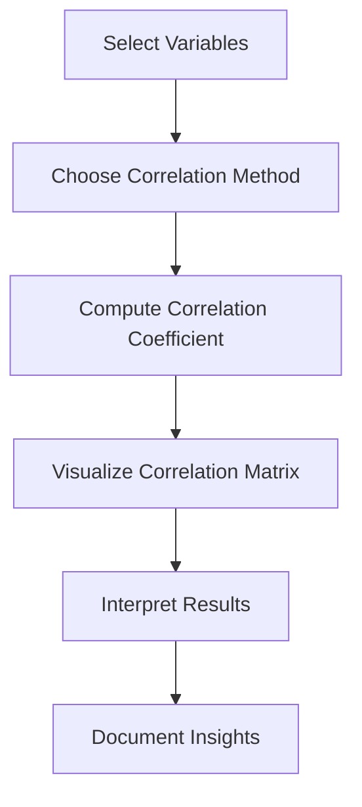

# 5.1 Conduct Correlation Analysis

## Introduction

Correlation analysis is a fundamental statistical technique used to measure the strength and direction of relationships between variables. In the context of loan approval prediction, understanding correlations among applicant characteristics, loan features, and outcomes can reveal important patterns, guide feature selection, and inform model development. This section explores correlation types, methods, interpretation, and best practices for analyzing relationships in loan datasets.

## Types of Correlation

- **Pearson Correlation:** Measures linear relationships between two continuous variables
- **Spearman Rank Correlation:** Measures monotonic relationships, suitable for ordinal or non-normally distributed data
- **Kendall Tau Correlation:** Measures ordinal association, robust to outliers
- **Point-Biserial Correlation:** Measures relationship between a binary and a continuous variable
- **Cramér’s V:** Measures association between two categorical variables

## Flowchart: Correlation Analysis Process

## Methods for Correlation Analysis

### 1. Correlation Matrix
- Compute pairwise correlations for all variables
- Visualize using heatmaps for easy interpretation

### 2. Scatter Plots
- Visualize relationships between pairs of variables
- Identify linear, non-linear, or no relationship

### 3. Statistical Tests
- Test significance of correlation coefficients (e.g., p-values)

## Interpretation of Results

- **Strength:** Correlation coefficients range from -1 (perfect negative) to +1 (perfect positive)
- **Direction:** Positive values indicate direct relationships; negative values indicate inverse relationships
- **Significance:** Use p-values to assess if correlations are statistically significant
- **Practical Relevance:** Focus on correlations that are both statistically and practically meaningful

## Best Practices

- **Check for Multicollinearity:** Highly correlated features can distort model estimates
- **Visualize Relationships:** Use heatmaps and scatter plots to supplement numerical results
- **Segment Analysis:** Analyze correlations within subgroups (e.g., approved vs. rejected)
- **Document Findings:** Record all significant correlations and their implications for modeling

## Common Challenges

- **Spurious Correlations:** Correlations may arise by chance or due to confounding variables
- **Non-Linear Relationships:** Pearson correlation may miss non-linear associations
- **High-Dimensional Data:** Large numbers of variables can complicate interpretation

## Conclusion

Correlation analysis provides valuable insights into the relationships among variables in loan datasets. By systematically measuring and interpreting correlations, researchers can identify key predictors, avoid multicollinearity, and build more effective loan approval prediction models.
