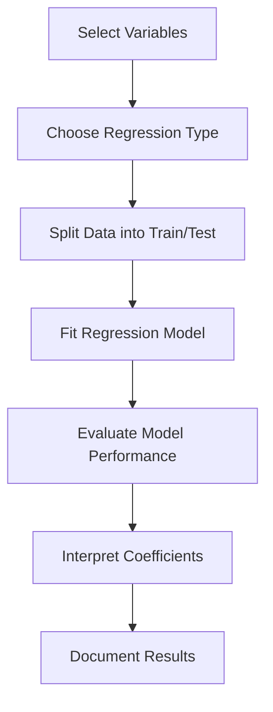

# 5.2 Build Simple and Multiple Regression Models

## Introduction

Regression analysis is a powerful statistical technique used to model the relationship between a dependent variable and one or more independent variables. In loan approval prediction, regression models help quantify the impact of applicant and loan characteristics on approval outcomes, enabling both prediction and interpretation. This section explores simple and multiple regression models, their construction, interpretation, and best practices in the context of loan data.

## Types of Regression

- **Simple Linear Regression:** Models the relationship between one independent variable and a continuous dependent variable
- **Multiple Linear Regression:** Models the relationship between multiple independent variables and a continuous dependent variable
- **Logistic Regression:** Models the probability of a binary outcome (e.g., loan approved or not)
- **Regularized Regression:** Includes Lasso, Ridge, and Elastic Net to prevent overfitting

## Flowchart: Regression Modeling Process

## Model Building Steps

### 1. Data Preparation
- Select relevant features and target variable
- Handle missing values and outliers
- Encode categorical variables
- Normalize or scale numeric fields

### 2. Model Selection
- Choose appropriate regression type based on target variable
- For binary outcomes, use logistic regression
- For continuous outcomes, use linear regression

### 3. Model Training
- Split data into training and test sets
- Fit the model using training data
- Tune hyperparameters if necessary

### 4. Model Evaluation
- Assess performance using metrics such as R-squared, RMSE (for linear), accuracy, precision, recall, AUC (for logistic)
- Check for overfitting using cross-validation

### 5. Interpretation
- Analyze regression coefficients to understand variable impact
- Assess statistical significance (p-values)
- Check for multicollinearity among predictors

## Best Practices

- **Feature Selection:** Use domain knowledge and statistical tests to select relevant predictors
- **Check Assumptions:** Ensure linearity, independence, homoscedasticity, and normality of residuals
- **Regularization:** Apply Lasso or Ridge to handle multicollinearity and prevent overfitting
- **Interpretability:** Focus on models that are both accurate and explainable
- **Document All Steps:** Record model specifications, assumptions, and results

## Common Challenges

- **Overfitting:** Model performs well on training data but poorly on new data
- **Multicollinearity:** Highly correlated predictors can distort coefficient estimates
- **Non-Linearity:** Relationships may not be strictly linear
- **Imbalanced Data:** Binary outcomes may be skewed

## Conclusion

Building simple and multiple regression models is a cornerstone of predictive analytics in loan approval projects. By carefully selecting features, validating assumptions, and interpreting results, researchers can develop robust models that provide both predictive power and actionable insights.
