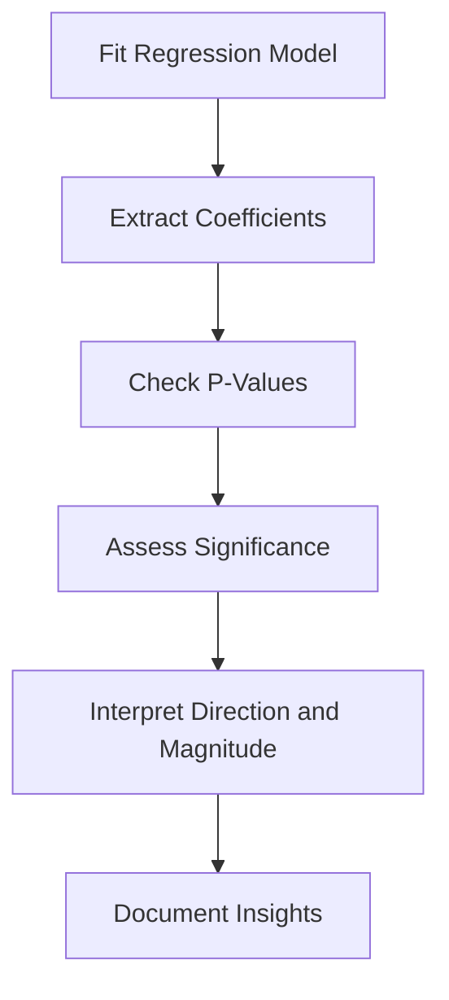

# 5.3 Interpret Coefficients and P-Values

## Introduction

Interpreting the results of regression models is essential for translating statistical findings into actionable business insights. In loan approval prediction, understanding the meaning of coefficients and p-values helps identify which variables significantly influence approval decisions and how they do so. This section explores the interpretation of regression outputs, the significance of coefficients and p-values, and best practices for drawing valid conclusions from model results.

## What are Coefficients?

- **Definition:** Coefficients represent the estimated change in the dependent variable for a one-unit change in the independent variable, holding other variables constant
- **Sign:** Positive coefficients indicate a direct relationship; negative coefficients indicate an inverse relationship
- **Magnitude:** Reflects the strength of the relationship

## What are P-Values?

- **Definition:** P-values measure the probability that the observed relationship occurred by chance
- **Threshold:** Commonly, a p-value < 0.05 is considered statistically significant
- **Interpretation:** Low p-values suggest strong evidence against the null hypothesis (no effect)

## Flowchart: Model Interpretation Process

## Steps for Interpreting Regression Results

### 1. Extract Coefficients and P-Values
- Use model summary outputs (e.g., `summary()` in R, `summary()` or `coef_` in Python)

### 2. Assess Statistical Significance
- Identify variables with p-values below the chosen threshold
- Focus on significant predictors for business interpretation

### 3. Interpret Direction and Magnitude
- Positive coefficients: Increase in predictor increases likelihood of approval
- Negative coefficients: Increase in predictor decreases likelihood of approval
- Larger absolute values indicate stronger effects

### 4. Consider Practical Significance
- Assess whether statistically significant effects are meaningful in practice
- Small coefficients may be statistically significant but have little business impact

### 5. Check for Multicollinearity
- High correlation among predictors can distort coefficient estimates
- Use variance inflation factor (VIF) to assess multicollinearity

## Best Practices

- **Contextualize Results:** Relate findings to business objectives and domain knowledge
- **Visualize Effects:** Use coefficient plots or marginal effect plots for clarity
- **Report Confidence Intervals:** Provide ranges for coefficient estimates
- **Document All Interpretations:** Record rationale for conclusions and recommendations

## Common Challenges

- **Over-Interpretation:** Avoid drawing strong conclusions from marginally significant results
- **Omitted Variable Bias:** Excluding relevant variables can bias estimates
- **Multiple Comparisons:** Adjust for multiple testing when interpreting many coefficients

## Conclusion

Interpreting coefficients and p-values is a critical step in regression analysis for loan approval prediction. By systematically assessing statistical and practical significance, researchers can identify key drivers of approval decisions and provide actionable recommendations for improving lending practices.
