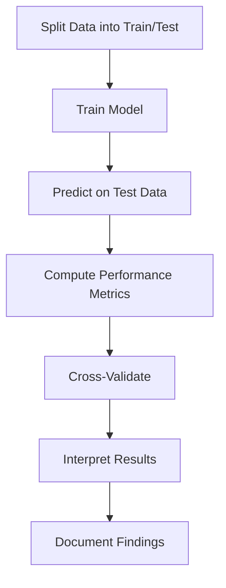

# 5.4 Validate Model Accuracy

## Introduction

Model validation is a critical step in the predictive modeling process, ensuring that the developed models generalize well to new, unseen data. In loan approval prediction, validating model accuracy helps prevent overfitting, builds confidence in model performance, and supports reliable decision-making. This section explores validation techniques, performance metrics, and best practices for assessing model accuracy in loan datasets.

## Why Validate Models?

- **Generalization:** Ensure models perform well on new data
- **Prevent Overfitting:** Avoid models that fit training data too closely
- **Build Trust:** Demonstrate reliability to stakeholders
- **Support Decision-Making:** Provide evidence for model adoption

## Flowchart: Model Validation Process

## Validation Techniques

### 1. Train-Test Split
- Divide data into training and test sets (e.g., 70/30 split)
- Train model on training set, evaluate on test set

### 2. Cross-Validation
- K-fold cross-validation: Split data into k subsets, train and test k times
- Leave-one-out cross-validation: Each observation is used as a test case once
- Reduces variance in performance estimates

### 3. Bootstrapping
- Resample data with replacement to estimate model accuracy
- Useful for small datasets

## Performance Metrics

### For Classification Models
- **Accuracy:** Proportion of correct predictions
- **Precision:** Proportion of positive predictions that are correct
- **Recall (Sensitivity):** Proportion of actual positives correctly identified
- **F1-Score:** Harmonic mean of precision and recall
- **AUC-ROC:** Area under the receiver operating characteristic curve
- **Confusion Matrix:** Table of true/false positives/negatives

### For Regression Models
- **R-squared:** Proportion of variance explained by the model
- **RMSE (Root Mean Squared Error):** Average prediction error
- **MAE (Mean Absolute Error):** Average absolute difference between predictions and actual values

## Best Practices

- **Use Multiple Metrics:** No single metric captures all aspects of performance
- **Visualize Results:** Use ROC curves, confusion matrices, and residual plots
- **Check for Data Leakage:** Ensure test data is not used in training
- **Document All Steps:** Record validation procedures and results
- **Iterate and Improve:** Use validation results to refine models

## Common Challenges

- **Imbalanced Data:** Accuracy may be misleading; use precision, recall, and AUC
- **Small Test Sets:** May lead to high variance in performance estimates
- **Overfitting:** Models that perform well on training but poorly on test data

## Conclusion

Validating model accuracy is essential for building robust, reliable, and trustworthy loan approval prediction models. By applying rigorous validation techniques and interpreting performance metrics, researchers can ensure their models are ready for deployment in real-world lending scenarios.
