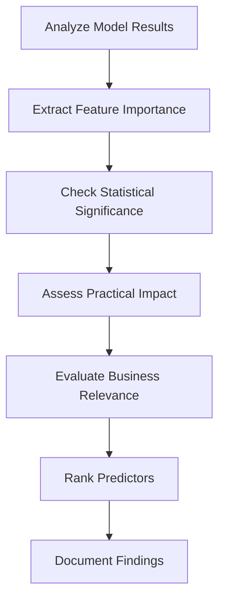

# 6.1 Identify Significant Predictors

## Introduction

Identifying significant predictors is a crucial step in loan approval prediction, as it helps understand which factors most strongly influence lending decisions. This process involves analyzing the statistical significance, practical importance, and business relevance of various features in predicting loan approval outcomes. By identifying key predictors, researchers can focus on the most impactful variables, improve model performance, and provide actionable insights for lending institutions.

## What Makes a Predictor Significant?

A predictor is considered significant when it demonstrates:
- **Statistical Significance:** Strong evidence against the null hypothesis (p-value < 0.05)
- **Practical Importance:** Substantial impact on the outcome variable
- **Business Relevance:** Meaningful contribution to lending decisions
- **Consistency:** Reliable performance across different samples and time periods

## Flowchart: Significant Predictor Identification Process

## Methods for Identifying Significant Predictors

### 1. Statistical Analysis
- **P-Values:** Variables with p-values < 0.05 are statistically significant
- **Confidence Intervals:** Narrow intervals indicate more precise estimates
- **Effect Sizes:** Standardized coefficients show relative importance

### 2. Feature Importance Metrics
- **Coefficient Magnitude:** Larger absolute values indicate stronger effects
- **Standardized Coefficients:** Compare effects across different scales
- **Odds Ratios:** For logistic regression, show multiplicative effects

### 3. Model-Based Importance
- **Random Forest Importance:** Measures feature contribution to model accuracy
- **Permutation Importance:** Assesses impact of feature removal
- **SHAP Values:** Explain individual predictions and feature contributions

### 4. Business Domain Analysis
- **Industry Knowledge:** Align findings with lending expertise
- **Regulatory Compliance:** Consider factors required by regulations
- **Operational Feasibility:** Assess practical implementation

## Common Significant Predictors in Loan Approval

### 1. Credit History Variables
- **Credit Score:** Strong predictor of repayment ability
- **Debt-to-Income Ratio:** Measures financial capacity
- **Payment History:** Past delinquencies indicate risk
- **Credit Utilization:** High utilization suggests financial stress

### 2. Employment and Income
- **Annual Income:** Higher income correlates with approval
- **Employment Length:** Stability indicates reliability
- **Job Title/Industry:** Certain sectors may be preferred

### 3. Loan Characteristics
- **Loan Amount:** Larger loans may have higher rejection rates
- **Loan Purpose:** Some purposes are riskier than others
- **Loan Term:** Longer terms may increase risk

### 4. Demographic Factors
- **Age:** May indicate financial maturity
- **Home Ownership:** Ownership suggests stability
- **Geographic Location:** Regional economic factors

## Best Practices for Identifying Significant Predictors

- **Use Multiple Methods:** Combine statistical, model-based, and domain approaches
- **Consider Interactions:** Some variables may be significant only in combination
- **Validate Stability:** Check if predictors remain significant across different samples
- **Document Rationale:** Explain why each predictor is considered significant
- **Update Regularly:** Reassess predictors as data and business conditions change

## Common Challenges

- **Multicollinearity:** Correlated predictors may mask individual significance
- **Sample Size:** Small samples may fail to detect significant effects
- **Data Quality:** Poor data can obscure true relationships
- **Changing Patterns:** Predictors may lose significance over time

## Conclusion

Identifying significant predictors is essential for building effective loan approval models and understanding lending decision factors. By systematically analyzing statistical significance, practical importance, and business relevance, researchers can develop more accurate models and provide valuable insights for improving lending practices.
