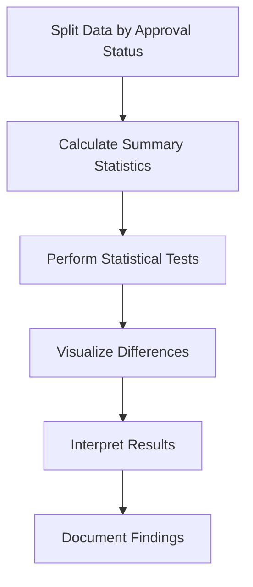

# 6.2 Compare Approved vs. Rejected Applications

## Introduction

Comparing approved versus rejected loan applications is a fundamental analysis that reveals the key differences between successful and unsuccessful applicants. This comparison helps identify the factors that most strongly influence lending decisions, understand the characteristics of different applicant groups, and assess the fairness and effectiveness of current approval processes. By systematically analyzing these differences, researchers can provide insights for improving lending policies and reducing bias in decision-making.

## Why Compare Approved vs. Rejected Applications?

- **Identify Key Factors:** Understand what distinguishes approved from rejected applicants
- **Assess Fairness:** Detect potential biases in approval processes
- **Improve Policies:** Inform changes to lending criteria and procedures
- **Reduce Risk:** Learn from patterns in rejected applications to improve risk assessment
- **Enhance Transparency:** Provide clear explanations for approval decisions

## Flowchart: Approval vs. Rejection Comparison Process

## Methods for Comparison

### 1. Descriptive Statistics
- **Means and Medians:** Compare central tendencies for numerical variables
- **Proportions:** Compare category distributions for categorical variables
- **Ranges and Variability:** Assess differences in data spread

### 2. Statistical Tests
- **T-Tests:** Compare means between approved and rejected groups
- **Chi-Square Tests:** Compare proportions for categorical variables
- **Mann-Whitney U Test:** Non-parametric alternative for skewed data
- **Effect Sizes:** Measure the magnitude of differences (Cohen's d, Cramer's V)

### 3. Visual Comparisons
- **Box Plots:** Show distribution differences for numerical variables
- **Bar Charts:** Compare proportions across categories
- **Density Plots:** Overlay distributions to see shape differences
- **Heatmaps:** Visualize multiple variable differences simultaneously

## Key Areas of Comparison

### 1. Credit History
- **Credit Scores:** Approved applicants typically have higher scores
- **Payment History:** Fewer delinquencies among approved applicants
- **Credit Utilization:** Lower utilization rates in approved group
- **Length of Credit History:** Longer histories often correlate with approval

### 2. Financial Characteristics
- **Income Levels:** Higher incomes among approved applicants
- **Debt-to-Income Ratio:** Lower ratios in approved group
- **Employment Stability:** Longer employment histories for approved applicants
- **Home Ownership:** Higher ownership rates among approved applicants

### 3. Loan Characteristics
- **Loan Amount:** May vary between approved and rejected groups
- **Loan Purpose:** Some purposes may have higher approval rates
- **Loan Term:** Different preferences between groups
- **Interest Rates:** Approved applicants may receive better rates

### 4. Demographic Factors
- **Age Distribution:** Different age patterns between groups
- **Geographic Location:** Regional differences in approval rates
- **Education Level:** May influence approval decisions
- **Industry/Employment Sector:** Certain sectors may be preferred

## Statistical Significance Testing

### 1. For Numerical Variables
- **Independent T-Test:** Compare means between groups
- **Effect Size:** Calculate Cohen's d to assess practical significance
- **Confidence Intervals:** Provide ranges for true differences

### 2. For Categorical Variables
- **Chi-Square Test:** Assess independence between approval status and categories
- **Cramer's V:** Measure strength of association
- **Odds Ratios:** Show relative likelihood of approval by category

## Best Practices for Comparison

- **Use Multiple Methods:** Combine descriptive, statistical, and visual approaches
- **Consider Effect Sizes:** Statistical significance doesn't always mean practical importance
- **Account for Confounding:** Control for other variables that may influence differences
- **Document All Findings:** Record both significant and non-significant differences
- **Interpret Carefully:** Correlation doesn't imply causation

## Common Challenges

- **Imbalanced Data:** Unequal group sizes can affect statistical power
- **Multiple Comparisons:** Testing many variables increases chance of false positives
- **Missing Data:** Different missing patterns between groups
- **Temporal Changes:** Approval criteria may change over time

## Implications of Findings

### 1. Policy Implications
- **Refine Criteria:** Adjust approval thresholds based on findings
- **Reduce Bias:** Address unfair differences in approval rates
- **Improve Efficiency:** Streamline processes for common approval patterns

### 2. Model Development
- **Feature Selection:** Focus on variables showing strong differences
- **Threshold Optimization:** Set appropriate cutoffs for approval decisions
- **Fairness Metrics:** Monitor for bias in automated systems

### 3. Business Insights
- **Risk Assessment:** Better understand factors contributing to rejection
- **Customer Targeting:** Identify characteristics of likely approved applicants
- **Process Improvement:** Optimize application and review procedures

## Conclusion

Comparing approved versus rejected applications provides valuable insights into lending decision factors and helps identify opportunities for improving approval processes. By systematically analyzing differences using multiple methods, researchers can develop more effective, fair, and transparent loan approval systems that benefit both lenders and borrowers.
