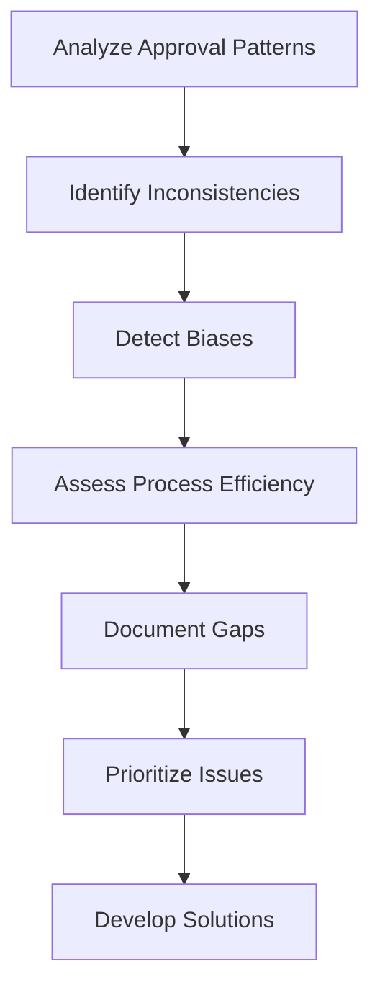

# 6.3 Highlight Decision-Making Gaps

## Introduction

Decision-making gaps in loan approval processes represent inconsistencies, inefficiencies, or biases that can lead to suboptimal outcomes for both lenders and borrowers. Identifying and analyzing these gaps is crucial for improving the fairness, accuracy, and efficiency of lending decisions. This section explores methods for detecting decision-making gaps, analyzing their causes and consequences, and developing strategies to address them.

## What are Decision-Making Gaps?

Decision-making gaps can be defined as:
- **Inconsistencies:** Similar applications receiving different decisions
- **Biases:** Systematic differences in approval rates across demographic groups
- **Inefficiencies:** Unnecessary complexity or delays in decision processes
- **Information Gaps:** Missing or inadequate data for making informed decisions
- **Process Gaps:** Steps in the approval process that don't add value

## Flowchart: Decision Gap Analysis Process

## Types of Decision-Making Gaps

### 1. Consistency Gaps
- **Similar Applications, Different Outcomes:** Cases where applicants with similar profiles receive different decisions
- **Temporal Inconsistencies:** Decisions varying over time without clear justification
- **Inter-Rater Variability:** Different loan officers making different decisions for similar cases

### 2. Bias Gaps
- **Demographic Bias:** Systematic differences in approval rates by age, gender, race, or location
- **Socioeconomic Bias:** Disparities based on income level, education, or employment sector
- **Geographic Bias:** Regional differences in approval rates not explained by economic factors

### 3. Efficiency Gaps
- **Processing Delays:** Unnecessary time spent on routine decisions
- **Redundant Steps:** Multiple reviews or approvals for straightforward cases
- **Information Overload:** Too much data obscuring key decision factors

### 4. Information Gaps
- **Missing Data:** Important variables not collected or available
- **Poor Data Quality:** Inaccurate or outdated information affecting decisions
- **Incomplete Analysis:** Key factors not considered in decision-making

## Methods for Identifying Decision Gaps

### 1. Pattern Analysis
- **Approval Rate Analysis:** Compare rates across different groups and time periods
- **Decision Tree Analysis:** Identify factors that lead to different outcomes
- **Cluster Analysis:** Group similar applications to detect inconsistent decisions

### 2. Statistical Testing
- **Chi-Square Tests:** Detect significant differences in approval rates
- **Logistic Regression:** Identify variables that predict approval decisions
- **Fairness Metrics:** Calculate statistical parity, equalized odds, and other fairness measures

### 3. Process Mapping
- **Workflow Analysis:** Document current decision processes
- **Bottleneck Identification:** Find steps that cause delays or inconsistencies
- **Stakeholder Interviews:** Gather insights from loan officers and applicants

## Common Decision-Making Gaps in Loan Approval

### 1. Credit Score Thresholds
- **Rigid Cutoffs:** Applicants just below thresholds may be creditworthy
- **Missing Context:** Credit scores don't capture all relevant factors
- **Temporal Issues:** Scores may not reflect current financial situation

### 2. Income and Employment Bias
- **Income Thresholds:** May exclude qualified applicants with irregular income
- **Employment Discrimination:** Bias against certain industries or job types
- **Gig Economy Gap:** Traditional employment metrics may not apply

### 3. Geographic and Demographic Disparities
- **Regional Bias:** Certain areas may have systematically different approval rates
- **Age Discrimination:** Younger or older applicants may face bias
- **Educational Bias:** Over-reliance on education level in decisions

### 4. Process Inefficiencies
- **Manual Reviews:** Too many applications requiring human review
- **Inconsistent Documentation:** Varying requirements across applications
- **Communication Gaps:** Poor communication between decision-makers

## Analyzing Decision Gaps

### 1. Root Cause Analysis
- **Why Analysis:** Ask "why" repeatedly to find underlying causes
- **Fishbone Diagrams:** Map out factors contributing to gaps
- **Stakeholder Analysis:** Identify who is affected by gaps

### 2. Impact Assessment
- **Business Impact:** Quantify costs of gaps (lost revenue, efficiency losses)
- **Customer Impact:** Assess effects on applicant experience and outcomes
- **Regulatory Impact:** Consider compliance and legal implications

### 3. Gap Prioritization
- **Frequency:** How often do gaps occur?
- **Severity:** What is the impact of each gap?
- **Feasibility:** How easy is it to address each gap?

## Strategies for Addressing Decision Gaps

### 1. Process Improvements
- **Standardization:** Develop consistent criteria and procedures
- **Automation:** Use technology to reduce human bias and improve efficiency
- **Training:** Educate decision-makers on bias and consistency

### 2. Data and Analytics
- **Enhanced Data Collection:** Gather more comprehensive applicant information
- **Predictive Modeling:** Use machine learning to improve decision accuracy
- **Continuous Monitoring:** Track decision patterns and outcomes

### 3. Policy Changes
- **Fair Lending Policies:** Implement policies to prevent discrimination
- **Transparency:** Provide clear explanations for decisions
- **Appeal Processes:** Establish fair mechanisms for challenging decisions

## Best Practices for Gap Analysis

- **Use Multiple Data Sources:** Combine quantitative and qualitative analysis
- **Include Stakeholder Perspectives:** Gather input from all affected parties
- **Monitor Continuously:** Regularly assess decision patterns and outcomes
- **Document Everything:** Record all findings and proposed solutions
- **Test Solutions:** Pilot changes before full implementation

## Common Challenges

- **Data Limitations:** Insufficient data to identify all gaps
- **Confidentiality:** Privacy concerns may limit analysis
- **Resistance to Change:** Stakeholders may resist addressing gaps
- **Complex Interactions:** Multiple factors may contribute to gaps

## Conclusion

Identifying and addressing decision-making gaps is essential for creating fair, efficient, and effective loan approval processes. By systematically analyzing patterns, detecting biases, and implementing targeted improvements, lending institutions can enhance their decision-making quality and better serve their customers while maintaining regulatory compliance and business objectives.
