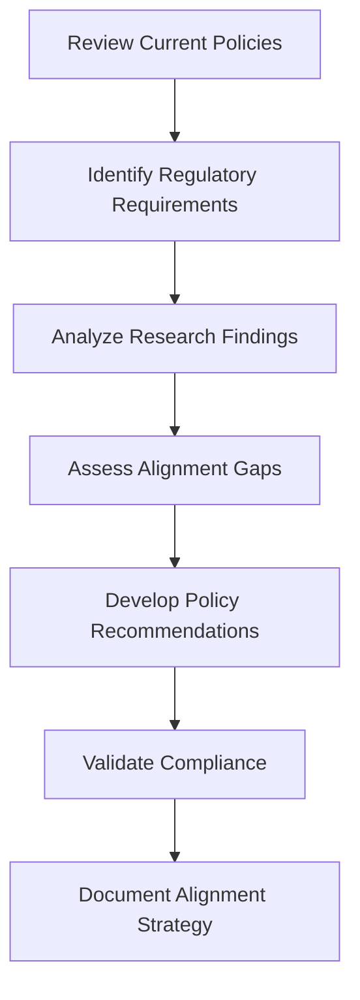

# 6.4 Align Findings with Policies

## Introduction

Aligning research findings with existing policies and regulatory frameworks is a critical step in ensuring that loan approval prediction models and recommendations are practical, compliant, and implementable. This process involves understanding current lending policies, regulatory requirements, and organizational constraints, then adapting research findings to fit within these frameworks while maintaining the integrity of the analysis and the goals of improving lending practices.

## Why Align Findings with Policies?

- **Regulatory Compliance:** Ensure recommendations meet legal and regulatory requirements
- **Practical Implementation:** Make findings actionable within existing organizational structures
- **Risk Management:** Avoid recommendations that could create legal or operational risks
- **Stakeholder Acceptance:** Increase likelihood of adoption by aligning with current policies
- **Sustainability:** Ensure changes can be maintained over time

## Flowchart: Policy Alignment Process

## Key Policy Areas to Consider

### 1. Fair Lending Regulations
- **Equal Credit Opportunity Act (ECOA):** Prohibits discrimination in lending
- **Fair Housing Act:** Prevents discrimination in housing-related lending
- **Community Reinvestment Act (CRA):** Encourages lending in underserved communities
- **Regulation B:** Implements ECOA requirements

### 2. Data Privacy and Security
- **Gramm-Leach-Bliley Act (GLBA):** Protects consumer financial information
- **Fair Credit Reporting Act (FCRA):** Governs use of credit information
- **General Data Protection Regulation (GDPR):** If applicable to international operations
- **State Privacy Laws:** Various state-level privacy protections

### 3. Risk Management Policies
- **Capital Requirements:** Basel III and other capital adequacy standards
- **Credit Risk Management:** Internal policies for managing credit risk
- **Model Risk Management:** Guidelines for using predictive models
- **Operational Risk:** Policies for day-to-day lending operations

### 4. Consumer Protection
- **Truth in Lending Act (TILA):** Requires clear disclosure of loan terms
- **Real Estate Settlement Procedures Act (RESPA):** For mortgage lending
- **Consumer Financial Protection Bureau (CFPB):** Various consumer protection rules

## Methods for Policy Alignment

### 1. Policy Gap Analysis
- **Current State Assessment:** Document existing policies and procedures
- **Gap Identification:** Find areas where research findings don't align with policies
- **Impact Analysis:** Assess the consequences of misalignment
- **Solution Development:** Create recommendations that bridge gaps

### 2. Regulatory Compliance Review
- **Legal Review:** Have legal experts review recommendations
- **Compliance Testing:** Test recommendations against regulatory requirements
- **Documentation:** Maintain records of compliance assessments
- **Monitoring:** Establish ongoing compliance monitoring

### 3. Stakeholder Engagement
- **Policy Makers:** Engage with those who create and enforce policies
- **Legal Teams:** Consult with legal experts on compliance issues
- **Risk Management:** Work with risk management teams
- **Operations Teams:** Include those who implement policies

## Common Policy Alignment Challenges

### 1. Regulatory Complexity
- **Multiple Jurisdictions:** Different rules at federal, state, and local levels
- **Changing Regulations:** Policies that evolve over time
- **Interpretation Differences:** Varying interpretations of regulatory requirements

### 2. Organizational Constraints
- **Resource Limitations:** Budget and personnel constraints
- **Technology Limitations:** Existing systems may not support new approaches
- **Cultural Resistance:** Organizational resistance to change

### 3. Implementation Challenges
- **Timeline Constraints:** Need for immediate implementation vs. gradual rollout
- **Training Requirements:** Staff education needed for new processes
- **System Integration:** Technical challenges in implementing changes

## Strategies for Effective Policy Alignment

### 1. Phased Implementation
- **Pilot Programs:** Test changes on a small scale first
- **Gradual Rollout:** Implement changes incrementally
- **Feedback Loops:** Gather feedback and adjust as needed
- **Success Metrics:** Define clear measures of success

### 2. Documentation and Communication
- **Clear Documentation:** Document all policy changes and rationale
- **Stakeholder Communication:** Keep all stakeholders informed
- **Training Materials:** Develop training for staff on new policies
- **Monitoring Reports:** Regular reports on policy effectiveness

### 3. Continuous Monitoring
- **Performance Tracking:** Monitor the effectiveness of aligned policies
- **Compliance Auditing:** Regular audits to ensure continued compliance
- **Feedback Collection:** Gather feedback from all stakeholders
- **Policy Updates:** Regular reviews and updates of policies

## Best Practices for Policy Alignment

- **Start Early:** Begin policy alignment early in the research process
- **Engage Experts:** Include legal and compliance experts from the start
- **Document Everything:** Maintain detailed records of all decisions and rationale
- **Test Thoroughly:** Pilot all changes before full implementation
- **Monitor Continuously:** Establish ongoing monitoring and evaluation

## Implementation Considerations

### 1. Technology Requirements
- **System Compatibility:** Ensure new approaches work with existing systems
- **Data Requirements:** Assess data needs for new policies
- **Integration Challenges:** Plan for integration with existing processes

### 2. Training and Education
- **Staff Training:** Educate staff on new policies and procedures
- **Management Buy-in:** Ensure leadership supports policy changes
- **Ongoing Education:** Provide continuous training and updates

### 3. Risk Management
- **Risk Assessment:** Evaluate risks associated with policy changes
- **Contingency Planning:** Develop backup plans for potential issues
- **Insurance Considerations:** Assess insurance implications of changes

## Conclusion

Aligning research findings with existing policies is essential for creating practical, compliant, and sustainable improvements to loan approval processes. By systematically analyzing policy requirements, engaging stakeholders, and developing implementation strategies, researchers can ensure their findings lead to meaningful and lasting improvements in lending practices while maintaining regulatory compliance and organizational effectiveness.
