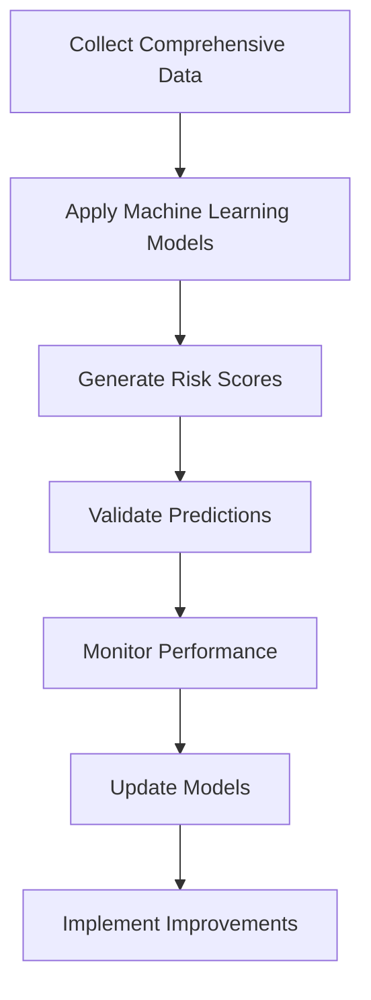

# 7.1 Propose Improved Risk Screening Methods

## Introduction

Risk screening is the cornerstone of loan approval processes, determining which applicants are likely to repay their loans and which pose higher default risks. Traditional screening methods often rely on limited data points and manual processes, leading to inconsistencies, biases, and missed opportunities. This section explores innovative approaches to risk screening that leverage advanced analytics, machine learning, and comprehensive data sources to create more accurate, fair, and efficient assessment methods.

## Current Limitations in Risk Screening

Traditional risk screening methods face several challenges:
- **Limited Data Sources:** Relying primarily on credit scores and basic financial information
- **Manual Processes:** Human judgment introducing bias and inconsistency
- **Static Models:** Inflexible approaches that don't adapt to changing conditions
- **Narrow Focus:** Missing alternative data that could improve predictions
- **Bias Issues:** Systematic discrimination against certain demographic groups

## Flowchart: Improved Risk Screening Process

## Proposed Improved Risk Screening Methods

### 1. Multi-Dimensional Risk Assessment
- **Credit History Analysis:** Traditional credit scores plus payment pattern analysis
- **Income Stability Assessment:** Multiple income sources, job stability, career progression
- **Debt Capacity Analysis:** Current obligations, debt-to-income ratios, cash flow analysis
- **Behavioral Indicators:** Banking patterns, bill payment history, financial responsibility
- **Economic Context:** Local economic conditions, industry trends, market factors

### 2. Alternative Data Integration
- **Utility Payment History:** Phone, electricity, and other utility payment records
- **Rental Payment History:** Previous rental payment behavior
- **Banking Transaction Data:** Spending patterns, savings behavior, account management
- **Employment Verification:** Job stability, salary progression, industry health
- **Social Media Analysis:** Professional networking, business activities (where appropriate)

### 3. Machine Learning Approaches
- **Ensemble Methods:** Combining multiple models for improved accuracy
- **Deep Learning:** Neural networks for complex pattern recognition
- **Time Series Analysis:** Predicting risk based on historical trends
- **Natural Language Processing:** Analyzing application narratives and documents
- **Anomaly Detection:** Identifying unusual patterns that may indicate risk

### 4. Real-Time Risk Monitoring
- **Continuous Assessment:** Updating risk scores as new information becomes available
- **Early Warning Systems:** Detecting potential problems before they become defaults
- **Market Condition Integration:** Adjusting risk assessments based on economic changes
- **Behavioral Scoring:** Tracking changes in applicant behavior over time

## Technology Infrastructure Requirements

### 1. Data Management Systems
- **Data Warehousing:** Centralized storage for all applicant information
- **Data Quality Management:** Ensuring accuracy and completeness of data
- **Privacy Protection:** Secure handling of sensitive information
- **Integration Capabilities:** Connecting multiple data sources seamlessly

### 2. Analytics Platforms
- **Machine Learning Infrastructure:** Platforms for model development and deployment
- **Real-Time Processing:** Systems for immediate risk assessment
- **Scalability:** Ability to handle large volumes of applications
- **API Integration:** Connecting with external data providers

### 3. Security and Compliance
- **Encryption:** Protecting sensitive data in transit and at rest
- **Access Controls:** Limiting data access to authorized personnel
- **Audit Trails:** Tracking all data access and model decisions
- **Regulatory Compliance:** Meeting all applicable privacy and lending regulations

## Implementation Strategy

### Phase 1: Foundation (Months 1-3)
- **Data Assessment:** Inventory current data sources and identify gaps
- **Technology Selection:** Choose appropriate platforms and tools
- **Pilot Program:** Test new methods on a small scale
- **Stakeholder Training:** Educate staff on new processes

### Phase 2: Development (Months 4-6)
- **Model Development:** Build and test machine learning models
- **Data Integration:** Connect multiple data sources
- **Validation Testing:** Ensure accuracy and fairness of new methods
- **Documentation:** Create comprehensive procedures and guidelines

### Phase 3: Deployment (Months 7-9)
- **Gradual Rollout:** Implement changes incrementally
- **Performance Monitoring:** Track effectiveness of new methods
- **Feedback Collection:** Gather input from users and applicants
- **Continuous Improvement:** Refine methods based on results

## Best Practices for Risk Screening

### 1. Fairness and Bias Prevention
- **Regular Bias Audits:** Systematically check for discrimination
- **Diverse Training Data:** Ensure models are trained on representative samples
- **Transparency:** Provide clear explanations for risk assessments
- **Appeal Processes:** Allow applicants to challenge decisions

### 2. Accuracy and Validation
- **Cross-Validation:** Test models on multiple datasets
- **Backtesting:** Validate against historical data
- **Performance Monitoring:** Track accuracy over time
- **Model Updates:** Regularly retrain models with new data

### 3. Operational Efficiency
- **Automation:** Reduce manual processes where possible
- **Standardization:** Consistent application of screening criteria
- **Documentation:** Clear procedures for all screening steps
- **Training:** Ongoing education for staff on new methods

## Expected Benefits

### 1. Improved Accuracy
- **Better Predictions:** More accurate identification of creditworthy applicants
- **Reduced Defaults:** Lower rates of loan defaults
- **Increased Approvals:** Approve more qualified applicants who might be rejected by traditional methods

### 2. Enhanced Fairness
- **Reduced Bias:** More objective assessment of applicants
- **Broader Access:** Increased access to credit for underserved populations
- **Transparency:** Clear explanations for all decisions

### 3. Operational Efficiency
- **Faster Processing:** Reduced time for risk assessment
- **Lower Costs:** Reduced manual review requirements
- **Scalability:** Ability to handle increased application volumes

## Risk Management Considerations

### 1. Model Risk
- **Validation:** Thorough testing of all models before deployment
- **Monitoring:** Continuous tracking of model performance
- **Backup Plans:** Fallback procedures if models fail
- **Documentation:** Comprehensive records of all model decisions

### 2. Data Risk
- **Quality Assurance:** Ensuring data accuracy and completeness
- **Privacy Protection:** Secure handling of all personal information
- **Compliance:** Meeting all regulatory requirements
- **Contingency Planning:** Backup data sources and procedures

### 3. Operational Risk
- **Change Management:** Managing the transition to new methods
- **Training:** Ensuring staff competence with new systems
- **Testing:** Thorough testing before full deployment
- **Monitoring:** Ongoing oversight of new processes

## Conclusion

Improved risk screening methods offer significant opportunities to enhance loan approval processes through better accuracy, increased fairness, and improved efficiency. By leveraging advanced analytics, comprehensive data sources, and machine learning, lending institutions can develop more sophisticated and effective risk assessment capabilities while maintaining regulatory compliance and operational excellence.
