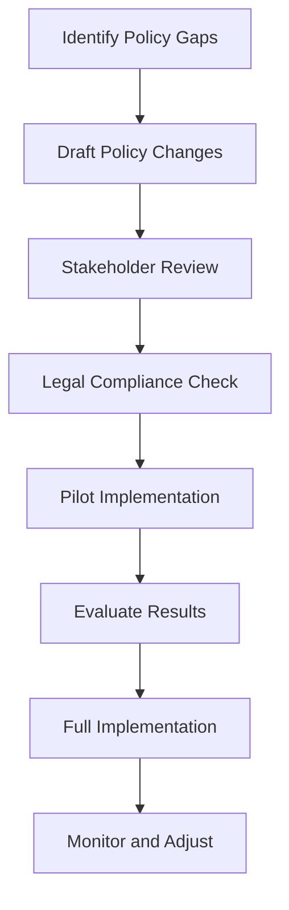

# 7.2 Suggest Policy Changes

## Introduction

Policy changes in loan approval processes are essential for implementing the findings and recommendations from predictive modeling research. These changes should address identified gaps, improve fairness and efficiency, and ensure compliance with regulatory requirements while enhancing the overall effectiveness of lending operations. This section explores specific policy recommendations, implementation strategies, and considerations for successful policy adoption.

## Areas Requiring Policy Changes

Based on the analysis of loan approval patterns and decision-making gaps, several policy areas need attention:

### 1. Risk Assessment Policies
- **Current Issues:** Over-reliance on credit scores, rigid thresholds, limited data sources
- **Proposed Changes:** Multi-dimensional risk assessment, flexible scoring models, alternative data integration
- **Implementation:** Gradual transition from traditional to enhanced risk models

### 2. Fair Lending Policies
- **Current Issues:** Potential bias in decision-making, lack of transparency, inconsistent application
- **Proposed Changes:** Bias monitoring systems, transparent decision criteria, regular fairness audits
- **Implementation:** Comprehensive training, monitoring systems, accountability measures

### 3. Data Collection and Usage Policies
- **Current Issues:** Limited data sources, privacy concerns, inconsistent data quality
- **Proposed Changes:** Expanded data collection, enhanced privacy protections, data quality standards
- **Implementation:** Updated consent forms, data governance frameworks, quality assurance processes

### 4. Process Efficiency Policies
- **Current Issues:** Manual processes, inconsistent procedures, lengthy approval times
- **Proposed Changes:** Automated decision systems, standardized procedures, streamlined workflows
- **Implementation:** Technology upgrades, process redesign, staff training

## Flowchart: Policy Change Implementation Process

## Specific Policy Recommendations

### 1. Enhanced Risk Assessment Policy
**Objective:** Implement more sophisticated risk assessment methods that improve accuracy and fairness.

**Key Components:**
- **Multi-Factor Scoring:** Combine traditional credit scores with alternative data sources
- **Dynamic Thresholds:** Adjust approval criteria based on economic conditions and applicant characteristics
- **Behavioral Analysis:** Include payment patterns and financial behavior in risk assessment
- **Industry-Specific Factors:** Consider sector-specific risks and opportunities

**Implementation Steps:**
1. Develop new risk scoring algorithms
2. Train staff on new assessment methods
3. Implement monitoring systems for model performance
4. Establish review processes for edge cases

### 2. Fair Lending Enhancement Policy
**Objective:** Ensure equal treatment of all applicants regardless of demographic characteristics.

**Key Components:**
- **Bias Monitoring:** Regular audits of approval rates by demographic group
- **Transparent Criteria:** Clear explanation of decision factors and weights
- **Appeal Processes:** Fair mechanisms for challenging decisions
- **Diversity Training:** Education for staff on unconscious bias

**Implementation Steps:**
1. Establish bias monitoring systems
2. Develop transparent decision criteria
3. Create appeal and review processes
4. Implement staff training programs

### 3. Data Governance Policy
**Objective:** Ensure responsible collection, use, and protection of applicant data.

**Key Components:**
- **Data Quality Standards:** Requirements for accuracy and completeness
- **Privacy Protections:** Enhanced security and consent procedures
- **Data Retention:** Clear policies on data storage and disposal
- **Access Controls:** Limiting data access to authorized personnel

**Implementation Steps:**
1. Update data collection procedures
2. Enhance security systems
3. Develop data quality monitoring
4. Establish data governance committees

### 4. Process Efficiency Policy
**Objective:** Streamline approval processes while maintaining quality and compliance.

**Key Components:**
- **Automated Decision Systems:** Technology-assisted approval processes
- **Standardized Procedures:** Consistent application of policies
- **Performance Metrics:** Clear measures of efficiency and quality
- **Continuous Improvement:** Regular review and optimization of processes

**Implementation Steps:**
1. Implement automated decision systems
2. Standardize procedures and documentation
3. Establish performance monitoring
4. Create improvement feedback loops

## Implementation Strategy

### Phase 1: Preparation (Months 1-2)
- **Policy Development:** Draft detailed policy documents
- **Stakeholder Engagement:** Consult with all affected parties
- **Legal Review:** Ensure compliance with all regulations
- **Resource Planning:** Identify required resources and budget

### Phase 2: Pilot Implementation (Months 3-4)
- **Select Test Groups:** Choose representative samples for pilot testing
- **Implement Changes:** Apply new policies to pilot groups
- **Monitor Results:** Track performance and gather feedback
- **Adjust Policies:** Refine based on pilot results

### Phase 3: Full Implementation (Months 5-8)
- **Gradual Rollout:** Implement changes across all operations
- **Training Programs:** Educate all staff on new policies
- **Monitoring Systems:** Establish ongoing oversight
- **Feedback Collection:** Gather input from all stakeholders

### Phase 4: Optimization (Ongoing)
- **Performance Review:** Regular assessment of policy effectiveness
- **Policy Updates:** Refine policies based on results
- **Continuous Improvement:** Ongoing optimization of processes
- **Stakeholder Communication:** Regular updates on policy performance

## Impact Assessment

### 1. Quantitative Measures
- **Approval Rates:** Changes in overall and demographic-specific approval rates
- **Processing Times:** Reduction in application processing time
- **Default Rates:** Impact on loan performance and default rates
- **Cost Savings:** Reduction in operational costs
- **Customer Satisfaction:** Improvements in applicant experience

### 2. Qualitative Measures
- **Fairness Perception:** Stakeholder views on policy fairness
- **Transparency:** Clarity of decision-making processes
- **Compliance:** Adherence to regulatory requirements
- **Staff Satisfaction:** Employee satisfaction with new policies
- **Stakeholder Feedback:** Input from applicants, staff, and regulators

## Risk Management

### 1. Regulatory Risk
- **Compliance Monitoring:** Regular checks for regulatory compliance
- **Legal Review:** Ongoing legal assessment of policy changes
- **Regulatory Communication:** Proactive engagement with regulators
- **Documentation:** Comprehensive records of all policy decisions

### 2. Operational Risk
- **Change Management:** Managing the transition to new policies
- **Training Requirements:** Ensuring staff competence with new procedures
- **System Integration:** Technical challenges in implementing changes
- **Contingency Planning:** Backup plans for policy failures

### 3. Reputational Risk
- **Stakeholder Communication:** Clear communication about policy changes
- **Transparency:** Open disclosure of policy objectives and methods
- **Feedback Mechanisms:** Channels for stakeholder input and concerns
- **Crisis Management:** Plans for addressing negative reactions

## Best Practices for Policy Implementation

### 1. Stakeholder Engagement
- **Early Involvement:** Include stakeholders in policy development
- **Clear Communication:** Explain the rationale and benefits of changes
- **Feedback Loops:** Establish mechanisms for ongoing input
- **Training and Support:** Provide adequate education and resources

### 2. Change Management
- **Gradual Implementation:** Avoid overwhelming changes
- **Pilot Testing:** Test policies before full implementation
- **Monitoring and Adjustment:** Continuously assess and refine policies
- **Documentation:** Maintain comprehensive records of all changes

### 3. Compliance and Risk Management
- **Legal Review:** Ensure all policies meet regulatory requirements
- **Risk Assessment:** Identify and mitigate potential risks
- **Monitoring Systems:** Establish oversight and reporting mechanisms
- **Contingency Planning:** Develop backup plans for potential issues

## Conclusion

Policy changes are essential for implementing the findings from loan approval prediction research and improving lending practices. By developing comprehensive, well-designed policies and implementing them through careful planning and stakeholder engagement, lending institutions can enhance their operations while maintaining compliance and serving their customers more effectively.
