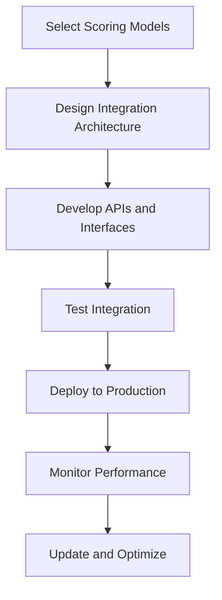

# 7.3 Recommend Scoring Model Integration

## Introduction

Scoring model integration is a critical component of modern loan approval systems, combining predictive analytics with operational processes to create more accurate, efficient, and fair lending decisions. This section explores the integration of various scoring models into existing loan approval workflows, including technical considerations, implementation strategies, and best practices for ensuring successful deployment and ongoing performance.

## Types of Scoring Models for Integration

### 1. Credit Scoring Models
- **Traditional FICO Scores:** Industry-standard credit risk assessment
- **Custom Credit Models:** Institution-specific credit scoring algorithms
- **Behavioral Scoring:** Payment pattern and financial behavior analysis
- **Alternative Credit Scoring:** Non-traditional data-based scoring methods

### 2. Risk Scoring Models
- **Default Risk Models:** Predicting likelihood of loan default
- **Fraud Detection Models:** Identifying potentially fraudulent applications
- **Prepayment Risk Models:** Assessing likelihood of early loan repayment
- **Portfolio Risk Models:** Managing overall loan portfolio risk

### 3. Application Scoring Models
- **Approval Scoring:** Overall application approval likelihood
- **Pricing Models:** Determining appropriate interest rates and terms
- **Limit Models:** Setting appropriate loan amounts
- **Product Matching:** Recommending suitable loan products

## Flowchart: Scoring Model Integration Process

## Integration Architecture Considerations

### 1. System Architecture
- **Modular Design:** Separate scoring models from core loan processing systems
- **API-First Approach:** Use application programming interfaces for model communication
- **Microservices Architecture:** Deploy models as independent services
- **Cloud-Native Solutions:** Leverage cloud infrastructure for scalability

### 2. Data Integration
- **Real-Time Data Feeds:** Connect to live data sources for current information
- **Batch Processing:** Handle large volumes of historical data
- **Data Quality Management:** Ensure accuracy and completeness of input data
- **Data Lineage Tracking:** Monitor data flow from source to model output

### 3. Security and Compliance
- **Data Encryption:** Protect sensitive information in transit and at rest
- **Access Controls:** Limit model access to authorized personnel
- **Audit Trails:** Track all model usage and decisions
- **Regulatory Compliance:** Meet all applicable privacy and lending regulations

## Implementation Strategy

### Phase 1: Planning and Design (Months 1-2)
- **Requirements Analysis:** Define specific scoring needs and objectives
- **Model Selection:** Choose appropriate scoring models for each use case
- **Architecture Design:** Plan system integration and data flows
- **Resource Planning:** Identify required technology and personnel

### Phase 2: Development and Testing (Months 3-5)
- **Model Development:** Build or customize scoring models
- **API Development:** Create interfaces for model integration
- **System Integration:** Connect models to existing loan processing systems
- **Testing and Validation:** Thorough testing of model accuracy and system performance

### Phase 3: Deployment and Monitoring (Months 6-8)
- **Pilot Deployment:** Test integration with a subset of applications
- **Full Deployment:** Roll out to all loan processing operations
- **Performance Monitoring:** Track model accuracy and system performance
- **User Training:** Educate staff on new scoring systems

### Phase 4: Optimization and Maintenance (Ongoing)
- **Model Updates:** Regular retraining and updating of scoring models
- **Performance Optimization:** Continuous improvement of system efficiency
- **Feature Engineering:** Adding new variables and improving model accuracy
- **Stakeholder Feedback:** Incorporating user input and business requirements

## Technical Implementation Details

### 1. Model Deployment
- **Containerization:** Use Docker or similar technologies for consistent deployment
- **Version Control:** Maintain different model versions for testing and rollback
- **Load Balancing:** Distribute model requests across multiple instances
- **Auto-scaling:** Automatically adjust resources based on demand

### 2. Data Pipeline
- **ETL Processes:** Extract, transform, and load data for model consumption
- **Real-Time Streaming:** Process data as it becomes available
- **Data Validation:** Ensure data quality before model processing
- **Error Handling:** Robust error management for data pipeline issues

### 3. Model Serving
- **REST APIs:** Standard web services for model communication
- **Batch Processing:** Handle large volumes of scoring requests
- **Caching:** Store frequently used model outputs for faster response
- **Fallback Mechanisms:** Backup procedures when models are unavailable

## Best Practices for Model Integration

### 1. Model Management
- **Version Control:** Maintain clear versioning of all models
- **A/B Testing:** Compare model performance before full deployment
- **Rollback Procedures:** Ability to revert to previous model versions
- **Documentation:** Comprehensive documentation of all models and processes

### 2. Performance Monitoring
- **Real-Time Monitoring:** Track model performance and system health
- **Alert Systems:** Automated notifications for performance issues
- **Performance Metrics:** Regular assessment of accuracy, speed, and reliability
- **Drift Detection:** Monitor for model performance degradation over time

### 3. Security and Compliance
- **Data Protection:** Secure handling of all applicant information
- **Access Controls:** Limit model access to authorized users
- **Audit Logging:** Comprehensive records of all model usage
- **Compliance Monitoring:** Regular checks for regulatory compliance

## Expected Benefits

### 1. Improved Accuracy
- **Better Predictions:** More accurate identification of creditworthy applicants
- **Reduced Defaults:** Lower rates of loan defaults through better risk assessment
- **Optimized Pricing:** More precise interest rate and term determination

### 2. Enhanced Efficiency
- **Faster Processing:** Reduced time for loan application processing
- **Automated Decisions:** Reduced manual review requirements
- **Scalability:** Ability to handle increased application volumes

### 3. Increased Fairness
- **Reduced Bias:** More objective assessment of applicants
- **Transparency:** Clear explanations for scoring decisions
- **Consistency:** Standardized application of scoring criteria

## Risk Management

### 1. Model Risk
- **Validation:** Thorough testing of all models before deployment
- **Monitoring:** Continuous tracking of model performance
- **Backup Plans:** Fallback procedures if models fail
- **Documentation:** Comprehensive records of all model decisions

### 2. Operational Risk
- **System Reliability:** Ensuring scoring systems are always available
- **Data Quality:** Maintaining accurate and complete input data
- **Performance:** Meeting speed and accuracy requirements
- **Integration:** Managing complex system interactions

### 3. Compliance Risk
- **Regulatory Requirements:** Meeting all applicable lending regulations
- **Fair Lending:** Ensuring models don't discriminate against protected groups
- **Transparency:** Providing clear explanations for scoring decisions
- **Audit Readiness:** Maintaining records for regulatory examinations

## Success Metrics

### 1. Technical Metrics
- **Model Accuracy:** Precision, recall, and overall accuracy measures
- **System Performance:** Response times and throughput
- **Availability:** System uptime and reliability
- **Data Quality:** Accuracy and completeness of input data

### 2. Business Metrics
- **Approval Rates:** Changes in overall and demographic-specific approval rates
- **Default Rates:** Impact on loan performance
- **Processing Times:** Reduction in application processing time
- **Cost Savings:** Reduction in operational costs

### 3. Compliance Metrics
- **Fair Lending Compliance:** Absence of discriminatory practices
- **Regulatory Compliance:** Adherence to all applicable regulations
- **Transparency:** Clarity of scoring explanations
- **Audit Success:** Successful regulatory examinations

## Conclusion

Scoring model integration represents a significant opportunity to enhance loan approval processes through improved accuracy, efficiency, and fairness. By carefully planning the integration architecture, implementing robust technical solutions, and maintaining ongoing monitoring and optimization, lending institutions can successfully deploy scoring models that provide substantial benefits while managing risks and ensuring compliance.
