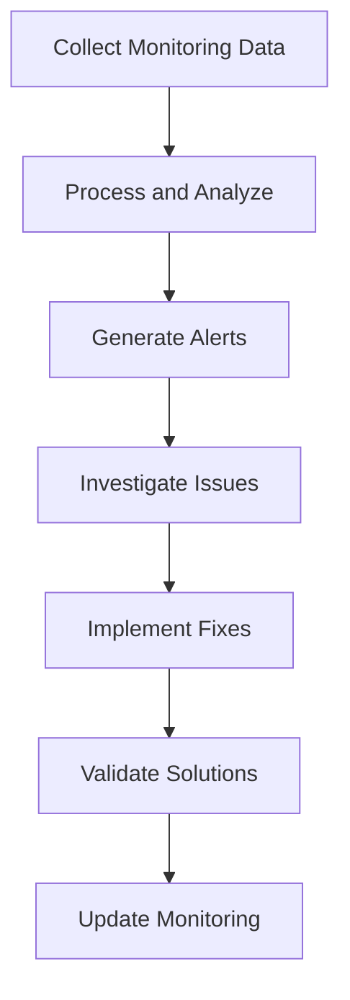

# 7.4 Recommend Monitoring Framework

## Introduction

A comprehensive monitoring framework is essential for ensuring the ongoing effectiveness, fairness, and compliance of loan approval prediction systems. This framework should track model performance, detect potential issues, ensure regulatory compliance, and provide insights for continuous improvement. This section explores the components of an effective monitoring framework, key metrics to track, and strategies for successful implementation and maintenance.

## Components of a Monitoring Framework

### 1. Model Performance Monitoring
- **Accuracy Metrics:** Track precision, recall, F1-score, and AUC over time
- **Drift Detection:** Monitor for changes in data distributions and model performance
- **Prediction Bias:** Assess fairness across different demographic groups
- **Model Stability:** Ensure consistent performance across different time periods

### 2. Data Quality Monitoring
- **Data Completeness:** Track missing values and data availability
- **Data Accuracy:** Monitor for errors and inconsistencies in input data
- **Data Freshness:** Ensure data is current and up-to-date
- **Data Lineage:** Track data flow from source to model output

### 3. System Performance Monitoring
- **Response Times:** Monitor model inference speed and system latency
- **Throughput:** Track the number of predictions processed per unit time
- **Availability:** Ensure systems are operational and accessible
- **Resource Utilization:** Monitor CPU, memory, and storage usage

### 4. Business Impact Monitoring
- **Approval Rates:** Track changes in overall and demographic-specific approval rates
- **Default Rates:** Monitor loan performance and default patterns
- **Processing Times:** Measure application processing efficiency
- **Customer Satisfaction:** Track applicant experience and feedback

## Flowchart: Monitoring Framework Process

## Key Monitoring Metrics

### 1. Model Performance Metrics
- **Classification Metrics:** Accuracy, precision, recall, F1-score, AUC-ROC
- **Regression Metrics:** R-squared, RMSE, MAE for continuous predictions
- **Fairness Metrics:** Statistical parity, equalized odds, demographic parity
- **Stability Metrics:** Coefficient of variation, performance consistency

### 2. Data Quality Metrics
- **Completeness:** Percentage of missing values by variable
- **Accuracy:** Error rates and data validation results
- **Consistency:** Cross-field validation and logical checks
- **Timeliness:** Data freshness and update frequency

### 3. System Performance Metrics
- **Response Time:** Average, median, and 95th percentile response times
- **Throughput:** Requests per second and processing capacity
- **Availability:** Uptime percentage and system reliability
- **Error Rates:** Failed requests and system errors

### 4. Business Metrics
- **Approval Rates:** Overall and segment-specific approval percentages
- **Default Rates:** Loan performance and default patterns
- **Processing Efficiency:** Time from application to decision
- **Cost Metrics:** Operational costs and efficiency gains

## Monitoring Framework Architecture

### 1. Data Collection Layer
- **Real-Time Streaming:** Collect data as it becomes available
- **Batch Processing:** Handle large volumes of historical data
- **API Integration:** Connect to various data sources and systems
- **Log Aggregation:** Centralize logs from multiple systems

### 2. Processing Layer
- **Data Processing:** Clean, transform, and validate monitoring data
- **Metric Calculation:** Compute performance and business metrics
- **Anomaly Detection:** Identify unusual patterns and potential issues
- **Alert Generation:** Create notifications for critical issues

### 3. Storage Layer
- **Time Series Database:** Store historical monitoring data
- **Data Warehouse:** Centralized storage for analysis and reporting
- **Real-Time Storage:** Fast access for current monitoring needs
- **Backup and Recovery:** Ensure data protection and availability

### 4. Visualization Layer
- **Dashboards:** Real-time and historical performance views
- **Reports:** Regular summaries and detailed analysis
- **Alerts:** Immediate notifications for critical issues
- **Analytics:** Advanced analysis and trend identification

## Implementation Strategy

### Phase 1: Foundation (Months 1-2)
- **Requirements Analysis:** Define monitoring needs and objectives
- **Architecture Design:** Plan monitoring system structure
- **Tool Selection:** Choose appropriate monitoring technologies
- **Data Source Identification:** Map all data sources for monitoring

### Phase 2: Development (Months 3-4)
- **Data Pipeline Development:** Build data collection and processing systems
- **Metric Implementation:** Develop calculation logic for all metrics
- **Dashboard Creation:** Build monitoring dashboards and reports
- **Alert Configuration:** Set up notification systems

### Phase 3: Deployment (Months 5-6)
- **Pilot Testing:** Test monitoring systems with subset of data
- **Full Deployment:** Roll out monitoring across all systems
- **User Training:** Educate staff on monitoring tools and procedures
- **Documentation:** Create comprehensive monitoring guides

### Phase 4: Optimization (Ongoing)
- **Performance Tuning:** Optimize monitoring system performance
- **Metric Refinement:** Improve metric definitions and calculations
- **Alert Optimization:** Fine-tune alert thresholds and notifications
- **Continuous Improvement:** Regular assessment and enhancement

## Best Practices for Monitoring

### 1. Comprehensive Coverage
- **End-to-End Monitoring:** Track entire loan approval process
- **Multi-Layer Monitoring:** Monitor data, models, systems, and business outcomes
- **Real-Time and Batch:** Combine immediate and historical monitoring
- **Proactive Monitoring:** Detect issues before they impact operations

### 2. Alert Management
- **Threshold Setting:** Establish appropriate alert thresholds
- **Escalation Procedures:** Define response procedures for different alert levels
- **False Positive Reduction:** Minimize unnecessary alerts
- **Alert Documentation:** Maintain clear records of all alerts and responses

### 3. Data Management
- **Data Retention:** Establish appropriate data retention policies
- **Data Security:** Ensure secure handling of monitoring data
- **Data Quality:** Maintain high quality monitoring data
- **Data Governance:** Establish clear data ownership and access policies

## Risk Management

### 1. Technical Risks
- **System Failures:** Monitor system health and performance
- **Data Loss:** Implement backup and recovery procedures
- **Performance Degradation:** Track system performance metrics
- **Integration Issues:** Monitor system integration points

### 2. Operational Risks
- **Staff Training:** Ensure adequate training on monitoring systems
- **Process Compliance:** Monitor adherence to established procedures
- **Change Management:** Track system and process changes
- **Documentation:** Maintain current documentation of all processes

### 3. Compliance Risks
- **Regulatory Monitoring:** Track compliance with applicable regulations
- **Audit Readiness:** Maintain records for regulatory examinations
- **Privacy Protection:** Ensure monitoring doesn't violate privacy requirements
- **Fair Lending:** Monitor for potential discriminatory practices

## Success Metrics for Monitoring Framework

### 1. Technical Success
- **System Reliability:** High availability and low error rates
- **Performance:** Fast response times and high throughput
- **Accuracy:** Reliable and accurate monitoring data
- **Scalability:** Ability to handle increased monitoring load

### 2. Business Success
- **Issue Detection:** Early identification of problems
- **Resolution Time:** Quick resolution of identified issues
- **Prevention:** Reduction in preventable problems
- **Insights:** Valuable business insights from monitoring data

### 3. Compliance Success
- **Regulatory Compliance:** Meeting all monitoring requirements
- **Audit Success:** Successful regulatory examinations
- **Documentation:** Complete and accurate monitoring records
- **Transparency:** Clear visibility into system operations

## Conclusion

A comprehensive monitoring framework is essential for maintaining the effectiveness, fairness, and compliance of loan approval prediction systems. By implementing robust monitoring across all aspects of the loan approval process, organizations can ensure continuous improvement, early problem detection, and sustained operational excellence while meeting regulatory requirements and maintaining stakeholder trust.
