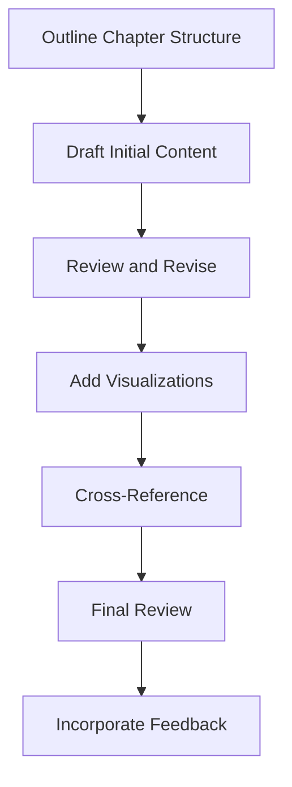

# 8.1 Draft Individual Report Chapters

## Introduction

Drafting individual report chapters is a critical step in compiling a comprehensive loan approval prediction project report. Each chapter should present a specific aspect of the research in a clear, logical, and well-structured manner. This section provides guidance on organizing chapter content, maintaining consistency across chapters, and ensuring that the final report effectively communicates the research findings, methodology, and recommendations to stakeholders.

## Chapter Structure and Organization

### 1. Executive Summary
- **Purpose:** Provide a concise overview of the entire project
- **Content:** Key findings, methodology summary, main recommendations
- **Length:** 2-3 pages maximum
- **Audience:** Senior management and decision-makers

### 2. Introduction and Background
- **Purpose:** Set the context and motivation for the research
- **Content:** Problem statement, research objectives, industry context
- **Length:** 5-8 pages
- **Audience:** General audience with varying technical backgrounds

### 3. Literature Review
- **Purpose:** Demonstrate understanding of existing research and knowledge gaps
- **Content:** Review of relevant studies, theoretical frameworks, methodology comparisons
- **Length:** 10-15 pages
- **Audience:** Academic and professional researchers

### 4. Methodology
- **Purpose:** Describe the research approach and methods used
- **Content:** Data collection, preprocessing, model development, validation techniques
- **Length:** 8-12 pages
- **Audience:** Technical professionals and researchers

### 5. Data Analysis and Results
- **Purpose:** Present findings and statistical analysis
- **Content:** Descriptive statistics, model performance, key insights
- **Length:** 15-20 pages
- **Audience:** Data scientists and business analysts

### 6. Discussion and Interpretation
- **Purpose:** Interpret results and discuss implications
- **Content:** Meaning of findings, comparison with literature, limitations
- **Length:** 10-15 pages
- **Audience:** Mixed audience including practitioners and researchers

### 7. Recommendations and Implementation
- **Purpose:** Provide actionable recommendations for improvement
- **Content:** Policy changes, technical improvements, implementation strategies
- **Length:** 8-12 pages
- **Audience:** Decision-makers and implementation teams

### 8. Conclusion
- **Purpose:** Summarize key contributions and future directions
- **Content:** Main achievements, limitations, future research opportunities
- **Length:** 3-5 pages
- **Audience:** All stakeholders

## Flowchart: Report Chapter Development Process

## Writing Guidelines for Each Chapter

### 1. Executive Summary
- **Start with Impact:** Lead with the most important findings
- **Be Concise:** Include only essential information
- **Use Clear Language:** Avoid technical jargon
- **Highlight Recommendations:** Emphasize actionable next steps

### 2. Introduction and Background
- **Establish Context:** Explain why the research is important
- **Define Problem:** Clearly state the research problem
- **Set Objectives:** List specific research goals
- **Preview Structure:** Outline the report organization

### 3. Literature Review
- **Organize Thematically:** Group related studies together
- **Show Progression:** Demonstrate how knowledge has evolved
- **Identify Gaps:** Highlight areas where research is needed
- **Be Critical:** Evaluate strengths and weaknesses of existing work

### 4. Methodology
- **Be Detailed:** Provide enough information for replication
- **Justify Choices:** Explain why specific methods were chosen
- **Address Limitations:** Acknowledge methodological constraints
- **Use Visuals:** Include diagrams and flowcharts where helpful

### 5. Data Analysis and Results
- **Present Objectively:** Report findings without interpretation
- **Use Visuals:** Include charts, graphs, and tables
- **Be Comprehensive:** Cover all relevant analyses
- **Include Statistics:** Provide appropriate statistical measures

### 6. Discussion and Interpretation
- **Interpret Meaning:** Explain what the results mean
- **Compare with Literature:** Relate findings to existing research
- **Address Limitations:** Discuss study limitations honestly
- **Consider Implications:** Discuss practical and theoretical implications

### 7. Recommendations and Implementation
- **Be Specific:** Provide concrete, actionable recommendations
- **Consider Feasibility:** Address practical implementation challenges
- **Prioritize:** Rank recommendations by importance and impact
- **Include Timeline:** Suggest implementation schedules

### 8. Conclusion
- **Summarize Key Points:** Recap main findings and contributions
- **Emphasize Impact:** Highlight the significance of the work
- **Suggest Future Work:** Identify areas for further research
- **End Strongly:** Conclude with a compelling final statement

## Content Organization Principles

### 1. Logical Flow
- **Progressive Disclosure:** Present information in logical sequence
- **Clear Transitions:** Use transitional phrases between sections
- **Consistent Structure:** Maintain similar organization across chapters
- **Hierarchical Organization:** Use headings and subheadings effectively

### 2. Audience Adaptation
- **Multiple Audiences:** Consider different reader backgrounds
- **Technical Depth:** Vary technical detail based on chapter purpose
- **Clear Explanations:** Define technical terms when necessary
- **Appropriate Examples:** Use relevant examples to illustrate points

### 3. Visual Communication
- **Strategic Use of Visuals:** Include charts, graphs, and diagrams
- **Consistent Formatting:** Use uniform visual style throughout
- **Clear Captions:** Provide descriptive captions for all visuals
- **Accessibility:** Ensure visuals are clear and understandable

## Quality Assurance Guidelines

### 1. Content Review
- **Accuracy Check:** Verify all facts and figures
- **Consistency Review:** Ensure consistency across chapters
- **Completeness Check:** Verify all required content is included
- **Clarity Assessment:** Ensure writing is clear and understandable

### 2. Technical Review
- **Methodology Validation:** Verify technical approaches are sound
- **Statistical Review:** Check statistical analyses and interpretations
- **Model Validation:** Ensure model development and evaluation are correct
- **Data Quality:** Verify data handling and preprocessing

### 3. Editorial Review
- **Grammar and Style:** Check for grammatical errors and style consistency
- **Formatting:** Ensure consistent formatting throughout
- **Citations:** Verify all references are properly cited
- **Appendices:** Check that all supporting materials are included

## Common Challenges and Solutions

### 1. Content Organization
- **Challenge:** Maintaining logical flow across chapters
- **Solution:** Create detailed outline and review chapter transitions

### 2. Technical Communication
- **Challenge:** Explaining complex concepts to diverse audiences
- **Solution:** Use clear language, examples, and visual aids

### 3. Consistency
- **Challenge:** Ensuring consistent terminology and formatting
- **Solution:** Create style guide and use templates

### 4. Completeness
- **Challenge:** Including all necessary information without overwhelming readers
- **Solution:** Use appendices for detailed technical information

## Best Practices for Chapter Development

### 1. Planning
- **Create Detailed Outline:** Plan chapter structure before writing
- **Set Timeline:** Establish deadlines for each chapter
- **Identify Dependencies:** Note chapters that depend on others
- **Allocate Resources:** Plan time for writing, review, and revision

### 2. Writing Process
- **Start Early:** Begin writing as soon as data is available
- **Write Regularly:** Maintain consistent writing schedule
- **Revise Continuously:** Review and improve content regularly
- **Seek Feedback:** Get input from colleagues and stakeholders

### 3. Quality Control
- **Multiple Reviews:** Have different people review different aspects
- **Fact Checking:** Verify all technical content and references
- **Consistency Checks:** Ensure terminology and formatting consistency
- **Final Review:** Comprehensive review before final submission

## Conclusion

Drafting individual report chapters is a systematic process that requires careful planning, clear communication, and rigorous quality control. By following structured guidelines and maintaining focus on the target audience, researchers can create comprehensive, well-organized chapters that effectively communicate their findings and contribute to the overall success of the loan approval prediction project.
