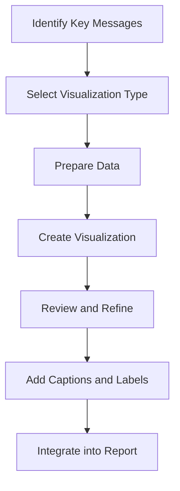

# 8.2 Include Visualizations and Statistical Outputs

## Introduction

Visualizations and statistical outputs are essential components of a comprehensive loan approval prediction project report. They provide clear, compelling evidence of research findings, support analytical conclusions, and help communicate complex information to diverse audiences. This section explores the types of visualizations and statistical outputs that should be included, best practices for their creation and presentation, and guidelines for ensuring they effectively support the report's objectives.

## Types of Visualizations to Include

### 1. Data Exploration Visualizations
- **Histograms and Distributions:** Show the distribution of key variables like loan amounts, income, credit scores
- **Box Plots:** Display the spread and outliers in numerical variables
- **Bar Charts:** Illustrate categorical variable distributions (e.g., loan purposes, approval rates)
- **Correlation Heatmaps:** Show relationships between variables
- **Scatter Plots:** Demonstrate relationships between pairs of variables

### 2. Model Performance Visualizations
- **ROC Curves:** Display model discrimination ability
- **Precision-Recall Curves:** Show trade-offs between precision and recall
- **Confusion Matrices:** Visualize classification results
- **Feature Importance Plots:** Show which variables most influence predictions
- **Model Comparison Charts:** Compare performance across different algorithms

### 3. Business Impact Visualizations
- **Approval Rate Comparisons:** Show differences across demographic groups
- **Risk Score Distributions:** Display how risk scores vary across populations
- **Processing Time Analysis:** Illustrate efficiency improvements
- **Cost-Benefit Analysis:** Show financial impact of model improvements

### 4. Process and Methodology Visualizations
- **Data Flow Diagrams:** Illustrate data processing steps
- **Model Architecture Diagrams:** Show how models are structured
- **Timeline Charts:** Display project milestones and progress
- **Decision Trees:** Visualize decision-making processes

## Flowchart: Visualization Development Process

## Statistical Outputs to Include

### 1. Descriptive Statistics
- **Summary Statistics:** Mean, median, standard deviation, quartiles for key variables
- **Frequency Tables:** Counts and percentages for categorical variables
- **Cross-Tabulations:** Relationships between categorical variables
- **Correlation Matrices:** Numerical correlation coefficients between variables

### 2. Model Performance Statistics
- **Classification Metrics:** Accuracy, precision, recall, F1-score, AUC
- **Regression Metrics:** R-squared, RMSE, MAE for continuous predictions
- **Statistical Significance Tests:** P-values, confidence intervals, effect sizes
- **Model Validation Results:** Cross-validation scores, test set performance

### 3. Fairness and Bias Statistics
- **Demographic Parity:** Approval rates across different groups
- **Equalized Odds:** Performance metrics by demographic group
- **Statistical Significance:** Tests for differences between groups
- **Effect Sizes:** Magnitude of differences between groups

### 4. Business Impact Statistics
- **Approval Rate Changes:** Before and after model implementation
- **Default Rate Analysis:** Impact on loan performance
- **Processing Efficiency:** Time and cost savings
- **ROI Calculations:** Return on investment from model improvements

## Best Practices for Visualization Creation

### 1. Design Principles
- **Clarity:** Ensure visualizations are easy to understand
- **Simplicity:** Avoid unnecessary complexity and clutter
- **Consistency:** Use uniform colors, fonts, and styles
- **Accessibility:** Ensure visualizations work for color-blind readers

### 2. Technical Guidelines
- **High Resolution:** Use vector formats for scalability
- **Appropriate Scales:** Choose scales that highlight important patterns
- **Clear Labels:** Include descriptive titles and axis labels
- **Color Coding:** Use colors meaningfully and consistently

### 3. Content Guidelines
- **Relevance:** Only include visualizations that support key messages
- **Accuracy:** Ensure visualizations accurately represent the data
- **Context:** Provide sufficient context for interpretation
- **Comparison:** Include baseline or comparison data where relevant

## Guidelines for Statistical Output Presentation

### 1. Table Design
- **Clear Headers:** Use descriptive column and row headers
- **Appropriate Precision:** Show appropriate number of decimal places
- **Consistent Formatting:** Use uniform formatting across tables
- **Notes and Sources:** Include footnotes for clarification

### 2. Statistical Reporting
- **Complete Information:** Include sample sizes, test statistics, p-values
- **Effect Sizes:** Report practical significance, not just statistical significance
- **Confidence Intervals:** Provide uncertainty estimates where appropriate
- **Interpretation:** Include brief interpretation of key statistics

### 3. Model Performance Reporting
- **Multiple Metrics:** Report several performance measures
- **Validation Results:** Include both training and test set performance
- **Comparison Basis:** Compare against baseline or alternative models
- **Practical Significance:** Interpret results in business context

## Integration into Report

### 1. Strategic Placement
- **Supporting Text:** Place visualizations near relevant text
- **Logical Flow:** Organize visualizations to tell a coherent story
- **Reference System:** Use clear figure and table numbers
- **Cross-References:** Link visualizations to text discussions

### 2. Caption and Labeling
- **Descriptive Captions:** Write captions that explain the visualization
- **Figure Numbers:** Use consistent numbering system
- **Source Attribution:** Credit data sources where appropriate
- **Interpretation Hints:** Provide guidance for interpretation

### 3. Accessibility Considerations
- **Color Alternatives:** Provide alternatives for color-dependent information
- **Text Descriptions:** Include text descriptions for complex visualizations
- **Font Size:** Ensure text is readable in final format
- **Print Compatibility:** Test how visualizations look when printed

## Quality Assurance for Visualizations and Outputs

### 1. Accuracy Checks
- **Data Verification:** Ensure visualizations match underlying data
- **Calculation Review:** Verify statistical calculations are correct
- **Consistency Check:** Ensure outputs are consistent across sections
- **Peer Review:** Have colleagues review visualizations and outputs

### 2. Clarity Assessment
- **Audience Testing:** Test with representative audience members
- **Interpretation Check:** Verify that visualizations convey intended message
- **Simplicity Review:** Remove unnecessary complexity
- **Context Provision:** Ensure sufficient context is provided

### 3. Technical Quality
- **Resolution Check:** Ensure visualizations are high quality
- **Format Compatibility:** Test compatibility with report format
- **Print Quality:** Verify visualizations look good when printed
- **Digital Accessibility:** Ensure digital versions are accessible

## Common Challenges and Solutions

### 1. Data Complexity
- **Challenge:** Presenting complex relationships clearly
- **Solution:** Use multiple visualizations, break down complex information

### 2. Audience Diversity
- **Challenge:** Meeting needs of technical and non-technical audiences
- **Solution:** Provide both detailed and simplified versions

### 3. Space Constraints
- **Challenge:** Fitting all necessary visualizations in limited space
- **Solution:** Prioritize most important visualizations, use appendices

### 4. Technical Limitations
- **Challenge:** Creating high-quality visualizations with available tools
- **Solution:** Use appropriate software, seek technical assistance

## Tools and Software Recommendations

### 1. Visualization Tools
- **Python:** Matplotlib, Seaborn, Plotly for statistical visualizations
- **R:** ggplot2, plotly for advanced statistical graphics
- **Business Intelligence:** Tableau, Power BI for interactive dashboards
- **General Purpose:** Excel, Google Sheets for simple charts

### 2. Statistical Software
- **Statistical Analysis:** R, Python (pandas, scipy) for statistical computations
- **Model Development:** scikit-learn, TensorFlow for machine learning
- **Reporting:** Jupyter notebooks for reproducible analysis
- **Documentation:** LaTeX, Markdown for technical documentation

## Conclusion

Visualizations and statistical outputs are crucial for effectively communicating the findings of loan approval prediction research. By carefully selecting appropriate visualizations, ensuring high quality statistical outputs, and integrating them effectively into the report, researchers can create compelling, evidence-based presentations that support their conclusions and recommendations while serving the needs of diverse stakeholders.
