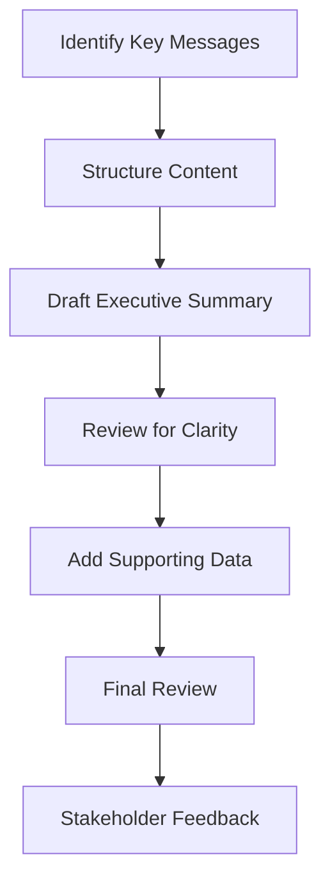

# 8.3 Create Executive Summary

## Introduction

The executive summary is the most critical component of a loan approval prediction project report, serving as the primary document that senior management and decision-makers will read. It must convey the essential findings, methodology, and recommendations in a concise, compelling manner that enables informed decision-making. This section provides comprehensive guidance on creating an effective executive summary that captures the project's value and impact while maintaining clarity and accessibility for non-technical audiences.

## Purpose and Importance of the Executive Summary

### 1. Primary Functions
- **Decision Support:** Provide executives with key information for strategic decisions
- **Project Overview:** Summarize the entire project scope and outcomes
- **Value Proposition:** Demonstrate the business value and ROI of the research
- **Stakeholder Communication:** Serve as the primary communication tool for diverse audiences

### 2. Target Audience
- **Senior Management:** CEOs, CFOs, and other C-level executives
- **Board Members:** Directors who need high-level understanding
- **Regulators:** Officials who require compliance and risk information
- **Investors:** Stakeholders interested in business impact and returns

### 3. Key Characteristics
- **Concise:** Typically 2-3 pages maximum
- **Clear:** Written in accessible language without technical jargon
- **Comprehensive:** Cover all major aspects of the project
- **Actionable:** Provide clear next steps and recommendations

## Flowchart: Executive Summary Development Process

## Structure and Content Organization

### 1. Opening Statement
- **Problem Statement:** Brief description of the challenge or opportunity
- **Business Context:** Why this project matters to the organization
- **Scope:** What the project covered and its boundaries
- **Objectives:** Clear statement of what the project aimed to achieve

### 2. Methodology Overview
- **Approach:** High-level description of the research methodology
- **Data Sources:** Key data used in the analysis
- **Analytical Methods:** Types of models and techniques employed
- **Validation:** How results were verified and tested

### 3. Key Findings
- **Primary Results:** Most important discoveries and insights
- **Performance Metrics:** Key performance indicators and improvements
- **Statistical Significance:** Evidence supporting the findings
- **Business Impact:** Quantified benefits and improvements

### 4. Recommendations
- **Strategic Recommendations:** High-level policy and process changes
- **Implementation Priorities:** Ranked list of most important actions
- **Resource Requirements:** Estimated costs and resource needs
- **Timeline:** Suggested implementation schedule

### 5. Risk Assessment
- **Implementation Risks:** Potential challenges and mitigation strategies
- **Regulatory Considerations:** Compliance requirements and implications
- **Technical Risks:** System and data-related concerns
- **Business Continuity:** Impact on ongoing operations

## Writing Guidelines and Best Practices

### 1. Language and Style
- **Clear and Concise:** Use simple, direct language
- **Active Voice:** Write in active rather than passive voice
- **Professional Tone:** Maintain formal but accessible tone
- **Consistent Terminology:** Use consistent terms throughout

### 2. Content Guidelines
- **Lead with Impact:** Start with the most important findings
- **Quantify Results:** Include specific numbers and percentages
- **Provide Context:** Explain why results matter
- **Address Limitations:** Acknowledge any significant constraints

### 3. Visual Elements
- **Key Charts:** Include 2-3 most important visualizations
- **Summary Tables:** Present key metrics in tabular format
- **Infographics:** Use diagrams to illustrate complex processes
- **Color Coding:** Use colors to highlight important information

## Key Elements to Include

### 1. Business Impact Metrics
- **Approval Rate Changes:** Improvements in loan approval efficiency
- **Risk Reduction:** Decrease in default rates or risk exposure
- **Cost Savings:** Operational cost reductions
- **Revenue Impact:** Potential revenue increases or losses avoided

### 2. Technical Performance
- **Model Accuracy:** Key performance metrics (accuracy, precision, recall)
- **Fairness Metrics:** Evidence of unbiased decision-making
- **Processing Efficiency:** Improvements in application processing time
- **System Reliability:** Uptime and error rate improvements

### 3. Strategic Implications
- **Competitive Advantage:** How findings position the organization
- **Market Opportunities:** New customer segments or products enabled
- **Regulatory Compliance:** Enhanced compliance capabilities
- **Risk Management:** Improved risk assessment and mitigation

## Common Challenges and Solutions

### 1. Technical Complexity
- **Challenge:** Explaining complex analytical methods to non-technical audience
- **Solution:** Focus on business impact rather than technical details
- **Approach:** Use analogies and business language
- **Strategy:** Provide technical details in appendices

### 2. Data Limitations
- **Challenge:** Addressing incomplete or imperfect data
- **Solution:** Acknowledge limitations while emphasizing valid findings
- **Approach:** Be transparent about data quality issues
- **Strategy:** Focus on relative improvements rather than absolute accuracy

### 3. Stakeholder Conflicts
- **Challenge:** Balancing competing stakeholder interests
- **Solution:** Present findings objectively with clear evidence
- **Approach:** Acknowledge different perspectives
- **Strategy:** Provide options rather than single recommendations

### 4. Uncertainty and Risk
- **Challenge:** Communicating uncertainty in predictions and recommendations
- **Solution:** Provide confidence intervals and risk assessments
- **Approach:** Be honest about limitations and assumptions
- **Strategy:** Present scenarios rather than single-point estimates

## Quality Assurance Guidelines

### 1. Content Review
- **Accuracy Check:** Verify all facts, figures, and claims
- **Completeness Review:** Ensure all key points are covered
- **Clarity Assessment:** Test readability with target audience
- **Consistency Check:** Ensure alignment with full report

### 2. Technical Validation
- **Statistical Review:** Verify statistical claims and interpretations
- **Model Validation:** Ensure model performance claims are accurate
- **Data Verification:** Confirm data sources and calculations
- **Methodology Check:** Verify methodological descriptions

### 3. Stakeholder Review
- **Executive Feedback:** Get input from senior management
- **Technical Review:** Have technical experts review accuracy
- **Legal Review:** Ensure compliance with regulatory requirements
- **Final Approval:** Obtain necessary approvals before distribution

## Formatting and Presentation

### 1. Visual Design
- **Professional Layout:** Use clean, professional formatting
- **Consistent Styling:** Apply uniform fonts, colors, and spacing
- **White Space:** Use adequate spacing for readability
- **Visual Hierarchy:** Use headings and formatting to guide reading

### 2. Supporting Materials
- **Key Visualizations:** Include most important charts and graphs
- **Summary Tables:** Present key metrics in organized tables
- **Appendices:** Reference detailed technical information
- **Contact Information:** Provide contact details for follow-up questions

### 3. Distribution Considerations
- **Digital Format:** Ensure compatibility with various devices
- **Print Quality:** Optimize for both digital and print viewing
- **Accessibility:** Ensure accessibility for users with disabilities
- **Security:** Consider confidentiality and distribution controls

## Success Metrics for Executive Summary

### 1. Communication Effectiveness
- **Clarity:** Target audience understands key messages
- **Completeness:** All essential information is included
- **Engagement:** Readers are motivated to take action
- **Retention:** Key points are remembered after reading

### 2. Decision Support
- **Actionable:** Provides clear guidance for next steps
- **Evidence-Based:** Recommendations are supported by data
- **Prioritized:** Actions are ranked by importance and impact
- **Feasible:** Recommendations are practical to implement

### 3. Stakeholder Satisfaction
- **Executive Approval:** Senior management supports the summary
- **Technical Validation:** Experts confirm accuracy of content
- **Regulatory Compliance:** Meets all reporting requirements
- **Business Alignment:** Supports organizational objectives

## Conclusion

Creating an effective executive summary is both an art and a science, requiring careful balance between technical accuracy and business communication. By following structured guidelines, focusing on key business impacts, and ensuring clarity for diverse audiences, researchers can create executive summaries that effectively support decision-making and drive organizational change based on the loan approval prediction project findings. 