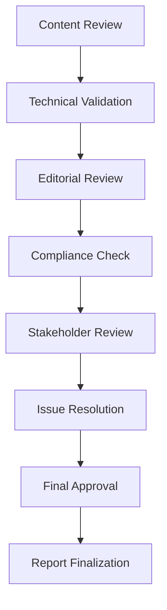

# 8.4 Conduct Final Review and Quality Assurance

## Introduction

The final review and quality assurance phase is the critical last step in creating a comprehensive loan approval prediction project report. This process ensures that the report meets the highest standards of accuracy, completeness, clarity, and professionalism before submission to stakeholders. This section provides a systematic approach to conducting thorough reviews, identifying and addressing issues, and ensuring the report is ready for final delivery.

## Purpose and Scope of Final Review

### 1. Primary Objectives
- **Accuracy Verification:** Ensure all facts, figures, and claims are correct
- **Completeness Check:** Verify all required content is included
- **Clarity Assessment:** Ensure the report is understandable to target audiences
- **Professional Standards:** Meet organizational and industry quality standards

### 2. Review Dimensions
- **Content Review:** Accuracy and completeness of information
- **Technical Review:** Validity of methods, models, and analyses
- **Editorial Review:** Grammar, style, and formatting consistency
- **Compliance Review:** Regulatory and policy requirements
- **Stakeholder Review:** Alignment with stakeholder needs and expectations

### 3. Quality Standards
- **Academic Rigor:** Meets scholarly standards for research methodology
- **Business Relevance:** Addresses practical business needs and objectives
- **Regulatory Compliance:** Satisfies all applicable legal and regulatory requirements
- **Professional Presentation:** Maintains high standards of professional communication

## Flowchart: Final Review and Quality Assurance Process

## Review Process Components

### 1. Content Review
- **Fact Checking:** Verify all claims, statistics, and references
- **Completeness Assessment:** Ensure all required sections are included
- **Logical Flow:** Check that arguments and conclusions are well-supported
- **Consistency Check:** Verify terminology and formatting consistency

### 2. Technical Validation
- **Methodology Review:** Validate research approach and methods
- **Statistical Analysis:** Check calculations and statistical interpretations
- **Model Performance:** Verify model accuracy and validation results
- **Data Quality:** Assess data handling and preprocessing procedures

### 3. Editorial Review
- **Grammar and Spelling:** Correct all grammatical and spelling errors
- **Style Consistency:** Ensure uniform writing style throughout
- **Clarity and Readability:** Improve sentence structure and flow
- **Formatting Standards:** Apply consistent formatting and layout

### 4. Compliance Review
- **Regulatory Requirements:** Ensure compliance with applicable regulations
- **Policy Alignment:** Verify alignment with organizational policies
- **Legal Considerations:** Check for potential legal issues or liabilities
- **Confidentiality:** Ensure proper handling of sensitive information

## Quality Assurance Guidelines

### 1. Accuracy Standards
- **Data Verification:** Cross-check all data sources and calculations
- **Citation Accuracy:** Verify all references and citations are correct
- **Statistical Validation:** Confirm statistical analyses are appropriate and correct
- **Model Validation:** Ensure model performance claims are accurate

### 2. Completeness Standards
- **Required Sections:** Verify all required report sections are included
- **Supporting Materials:** Ensure all appendices and references are complete
- **Visual Elements:** Check that all charts, graphs, and tables are included
- **Cross-References:** Verify all internal references are accurate

### 3. Clarity Standards
- **Audience Appropriateness:** Ensure content is suitable for target audiences
- **Technical Communication:** Verify complex concepts are explained clearly
- **Visual Clarity:** Check that visualizations are clear and informative
- **Executive Summary:** Ensure executive summary captures key points effectively

### 4. Professional Standards
- **Formatting Consistency:** Apply uniform formatting throughout
- **Professional Language:** Use appropriate tone and terminology
- **Visual Design:** Ensure professional appearance and layout
- **Documentation:** Include proper documentation and metadata

## Review Team and Responsibilities

### 1. Content Reviewers
- **Subject Matter Experts:** Domain experts who validate technical content
- **Business Analysts:** Professionals who assess business relevance
- **Data Scientists:** Technical experts who validate analytical methods
- **Industry Specialists:** Experts who verify industry-specific content

### 2. Editorial Reviewers
- **Technical Writers:** Professionals who improve clarity and readability
- **Copy Editors:** Experts who check grammar, style, and formatting
- **Graphic Designers:** Specialists who ensure visual quality
- **Communication Experts:** Professionals who assess overall effectiveness

### 3. Compliance Reviewers
- **Legal Experts:** Attorneys who check regulatory compliance
- **Risk Managers:** Professionals who assess risk implications
- **Privacy Officers:** Experts who verify data protection compliance
- **Regulatory Specialists:** Professionals familiar with industry regulations

### 4. Stakeholder Reviewers
- **Senior Management:** Executives who assess strategic alignment
- **Department Heads:** Managers who verify operational relevance
- **End Users:** Representatives who assess practical usability
- **External Stakeholders:** Partners or customers who provide feedback

## Review Checklists

### 1. Content Accuracy Checklist
- [ ] All facts and figures are verified and accurate
- [ ] All citations and references are correct and complete
- [ ] Statistical analyses are appropriate and correctly interpreted
- [ ] Model performance claims are supported by evidence
- [ ] Data sources are properly attributed and documented

### 2. Technical Validation Checklist
- [ ] Research methodology is sound and well-documented
- [ ] Data preprocessing steps are appropriate and complete
- [ ] Model development process is valid and reproducible
- [ ] Validation procedures are rigorous and comprehensive
- [ ] Results are statistically significant and practically meaningful

### 3. Editorial Quality Checklist
- [ ] Grammar and spelling are correct throughout
- [ ] Writing style is consistent and professional
- [ ] Sentences are clear and well-structured
- [ ] Formatting is uniform and professional
- [ ] Visual elements are clear and informative

### 4. Compliance Checklist
- [ ] All regulatory requirements are met
- [ ] Organizational policies are followed
- [ ] Legal considerations are addressed
- [ ] Confidentiality requirements are satisfied
- [ ] Data protection standards are maintained

## Issue Resolution Process

### 1. Issue Identification
- **Systematic Review:** Use checklists to identify all issues
- **Multiple Perspectives:** Gather input from different reviewers
- **Priority Assessment:** Rank issues by severity and impact
- **Documentation:** Record all issues for tracking and resolution

### 2. Issue Resolution
- **Technical Issues:** Address methodological and analytical problems
- **Content Issues:** Correct factual errors and improve clarity
- **Formatting Issues:** Fix layout, style, and presentation problems
- **Compliance Issues:** Resolve regulatory and policy concerns

### 3. Quality Control
- **Re-review Process:** Re-examine sections after changes
- **Validation:** Verify that issues are fully resolved
- **Consistency Check:** Ensure changes don't create new problems
- **Final Verification:** Confirm all issues are addressed

## Final Approval Process

### 1. Approval Criteria
- **Content Approval:** All content meets quality standards
- **Technical Approval:** All technical aspects are validated
- **Editorial Approval:** All editorial issues are resolved
- **Compliance Approval:** All regulatory requirements are met

### 2. Approval Workflow
- **Reviewer Sign-off:** Each reviewer approves their area of responsibility
- **Management Approval:** Senior management approves final version
- **Legal Review:** Legal team approves compliance aspects
- **Final Authorization:** Designated authority gives final approval

### 3. Documentation
- **Approval Records:** Document all approvals and sign-offs
- **Change Log:** Maintain record of all changes made
- **Version Control:** Track different versions of the report
- **Distribution List:** Record who receives the final report

## Finalization Steps

### 1. Document Preparation
- **Final Formatting:** Apply final formatting and styling
- **Quality Print:** Ensure high-quality printing and binding
- **Digital Version:** Prepare digital version for distribution
- **Backup Copies:** Create secure backup copies

### 2. Distribution Preparation
- **Stakeholder List:** Identify all recipients and their requirements
- **Delivery Methods:** Prepare appropriate delivery formats
- **Security Measures:** Implement necessary security controls
- **Follow-up Plan:** Plan for post-delivery communication

### 3. Post-Submission Activities
- **Feedback Collection:** Gather feedback from recipients
- **Issue Tracking:** Monitor for any post-submission issues
- **Documentation Update:** Update project documentation
- **Lessons Learned:** Document lessons for future projects

## Success Metrics for Final Review

### 1. Quality Metrics
- **Error Rate:** Minimize factual and technical errors
- **Completeness:** Ensure all required content is included
- **Clarity:** Achieve high readability and understanding scores
- **Professionalism:** Meet high standards of presentation

### 2. Stakeholder Satisfaction
- **Executive Approval:** Senior management satisfaction with final product
- **Technical Validation:** Expert approval of technical content
- **User Acceptance:** End-user satisfaction with usability
- **Regulatory Compliance:** Regulatory approval and compliance

### 3. Project Success
- **Timeline Adherence:** Meet all project deadlines
- **Budget Compliance:** Stay within allocated resources
- **Objective Achievement:** Meet all project objectives
- **Impact Measurement:** Demonstrate project value and impact

## Conclusion

The final review and quality assurance process is essential for ensuring that the loan approval prediction project report meets the highest standards of quality, accuracy, and professionalism. By conducting systematic reviews across all dimensions, addressing issues thoroughly, and obtaining proper approvals, researchers can deliver a report that effectively serves its intended purpose and meets stakeholder expectations. 