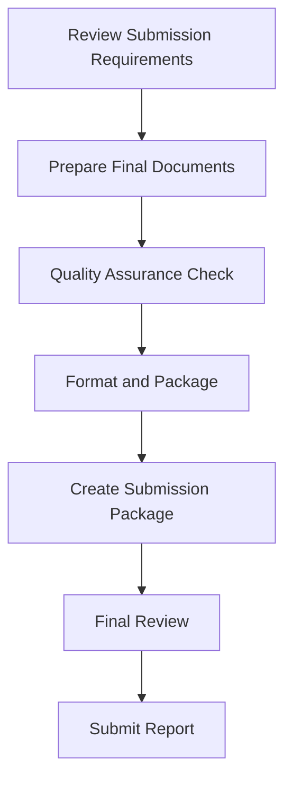

# 9.1 Prepare for Report Submission

## Introduction

Preparing for report submission is the final critical phase of a loan approval prediction project, ensuring that all deliverables are properly formatted, documented, and ready for distribution to stakeholders. This process involves careful attention to submission requirements, quality assurance, and proper documentation to ensure the report meets all expectations and requirements. This section provides comprehensive guidance on preparing for successful report submission.

## Submission Requirements and Standards

### 1. Format Requirements
- **Document Format:** PDF, Word, or other specified formats
- **Page Layout:** Standard margins, font sizes, and spacing
- **File Size:** Maximum file size limitations for digital submissions
- **Print Quality:** High-resolution output for physical copies
- **Accessibility:** Compliance with accessibility standards

### 2. Content Requirements
- **Complete Report:** All sections and appendices included
- **Executive Summary:** Standalone summary for senior management
- **Technical Documentation:** Detailed methodology and results
- **Supporting Materials:** Data, code, and additional resources
- **References:** Complete bibliography and citations

### 3. Quality Standards
- **Accuracy:** All information verified and validated
- **Completeness:** All required content included
- **Clarity:** Clear and understandable presentation
- **Professionalism:** High-quality formatting and presentation

## Flowchart: Submission Preparation Process

## Document Preparation Steps

### 1. Final Document Assembly
- **Executive Summary:** Create standalone executive summary
- **Main Report:** Compile complete technical report
- **Appendices:** Include all supporting materials
- **References:** Complete bibliography and citations
- **Index:** Create table of contents and index

### 2. Formatting and Styling
- **Consistent Formatting:** Apply uniform styles throughout
- **Professional Layout:** Use appropriate fonts, spacing, and margins
- **Visual Elements:** Ensure charts and graphs are clear
- **Page Numbering:** Add proper page numbers and sections
- **Headers and Footers:** Include appropriate headers and footers

### 3. Quality Control
- **Spell Check:** Run comprehensive spell and grammar checks
- **Fact Verification:** Verify all facts, figures, and claims
- **Cross-Reference Check:** Ensure all references are accurate
- **Consistency Review:** Check for consistent terminology and formatting

## Submission Package Components

### 1. Primary Documents
- **Executive Summary:** High-level overview for decision-makers
- **Technical Report:** Complete detailed report
- **Methodology Documentation:** Detailed research approach
- **Results and Analysis:** Comprehensive findings presentation
- **Recommendations:** Actionable recommendations and next steps

### 2. Supporting Materials
- **Data Documentation:** Description of data sources and processing
- **Code Repository:** Analysis scripts and model code
- **Model Documentation:** Detailed model specifications and validation
- **Visualization Files:** Source files for charts and graphs
- **Additional Resources:** Any supplementary materials

### 3. Administrative Documents
- **Cover Letter:** Introduction and submission context
- **Submission Checklist:** Verification of all requirements
- **Contact Information:** Author and project team details
- **Distribution List:** Recipients and stakeholders
- **Follow-up Plan:** Post-submission communication strategy

## Quality Assurance for Submission

### 1. Content Review
- **Accuracy Check:** Verify all information is correct
- **Completeness Review:** Ensure all required content is included
- **Clarity Assessment:** Confirm content is understandable
- **Consistency Check:** Verify terminology and formatting consistency

### 2. Technical Validation
- **Methodology Review:** Validate research approach
- **Statistical Analysis:** Check calculations and interpretations
- **Model Performance:** Verify model accuracy claims
- **Data Quality:** Assess data handling and preprocessing

### 3. Presentation Quality
- **Formatting Standards:** Apply consistent formatting
- **Visual Quality:** Ensure charts and graphs are clear
- **Professional Appearance:** Maintain high-quality presentation
- **Accessibility:** Ensure accessibility for all users

## Submission Requirements by Stakeholder

### 1. Executive Management
- **Executive Summary:** Concise overview of key findings
- **Business Impact:** Quantified benefits and recommendations
- **Strategic Implications:** Long-term business implications
- **Implementation Plan:** High-level implementation strategy

### 2. Technical Teams
- **Detailed Methodology:** Complete technical approach
- **Model Documentation:** Comprehensive model specifications
- **Code and Data:** All technical resources and materials
- **Validation Results:** Detailed performance metrics

### 3. Regulatory Bodies
- **Compliance Documentation:** Evidence of regulatory compliance
- **Fair Lending Analysis:** Bias and discrimination analysis
- **Risk Assessment:** Comprehensive risk evaluation
- **Transparency Documentation:** Model explainability and interpretability

### 4. External Stakeholders
- **Public Summary:** Non-technical summary for public consumption
- **Confidentiality Considerations:** Appropriate information sharing
- **Contact Information:** Points of contact for questions
- **Follow-up Procedures:** Process for additional information

## Submission Logistics

### 1. Delivery Methods
- **Digital Submission:** Email, file sharing, or online portals
- **Physical Delivery:** Printed copies for formal submissions
- **Presentation Delivery:** Live presentations to stakeholders
- **Archive Storage:** Secure storage for future reference

### 2. Security Considerations
- **Confidentiality:** Protect sensitive information
- **Access Controls:** Limit access to authorized personnel
- **Data Protection:** Ensure compliance with privacy regulations
- **Backup Copies:** Maintain secure backup copies

### 3. Distribution Planning
- **Stakeholder List:** Identify all recipients
- **Delivery Schedule:** Plan timing for different stakeholders
- **Follow-up Communication:** Plan post-submission communication
- **Feedback Collection:** Establish feedback gathering process

## Common Submission Challenges

### 1. Technical Issues
- **File Size Limitations:** Large files may exceed submission limits
- **Format Compatibility:** Ensuring compatibility across systems
- **Version Control:** Managing multiple versions and updates
- **Accessibility Requirements:** Meeting accessibility standards

### 2. Content Issues
- **Last-Minute Changes:** Handling late modifications
- **Stakeholder Conflicts:** Balancing competing requirements
- **Quality Assurance:** Ensuring thorough review under time pressure
- **Completeness:** Verifying all required content is included

### 3. Administrative Issues
- **Deadline Management:** Meeting submission deadlines
- **Approval Processes:** Obtaining necessary approvals
- **Resource Constraints:** Managing limited time and resources
- **Communication Coordination:** Coordinating with multiple stakeholders

## Best Practices for Submission Preparation

### 1. Early Planning
- **Timeline Development:** Create detailed submission timeline
- **Requirement Analysis:** Thoroughly understand all requirements
- **Resource Allocation:** Allocate sufficient time and resources
- **Stakeholder Coordination:** Coordinate with all involved parties

### 2. Quality Control
- **Multiple Reviews:** Conduct reviews at different stages
- **Expert Validation:** Have experts review technical content
- **User Testing:** Test with representative users
- **Final Verification:** Conduct comprehensive final review

### 3. Documentation
- **Submission Checklist:** Create detailed submission checklist
- **Version Control:** Maintain clear version control
- **Change Log:** Document all changes and modifications
- **Approval Records:** Maintain records of all approvals

## Post-Submission Activities

### 1. Follow-up Communication
- **Confirmation:** Confirm receipt of submission
- **Clarification:** Address any questions or concerns
- **Additional Information:** Provide supplementary materials if needed
- **Feedback Collection:** Gather feedback from recipients

### 2. Documentation Management
- **Archive Storage:** Store final versions securely
- **Project Documentation:** Update project documentation
- **Lessons Learned:** Document lessons for future projects
- **Knowledge Transfer:** Share knowledge with team members

### 3. Stakeholder Engagement
- **Presentation Opportunities:** Offer to present findings
- **Q&A Sessions:** Provide opportunities for questions
- **Implementation Support:** Offer support for implementation
- **Ongoing Communication:** Maintain communication channels

## Success Metrics for Submission

### 1. Submission Quality
- **Completeness:** All requirements met
- **Accuracy:** No errors in final submission
- **Professionalism:** High-quality presentation
- **Compliance:** Meets all regulatory requirements

### 2. Stakeholder Satisfaction
- **Executive Approval:** Senior management satisfaction
- **Technical Validation:** Expert approval of technical content
- **User Acceptance:** End-user satisfaction
- **Regulatory Compliance:** Regulatory approval

### 3. Project Success
- **Timeline Adherence:** Meeting all deadlines
- **Objective Achievement:** Meeting all project objectives
- **Impact Measurement:** Demonstrating project value
- **Knowledge Transfer:** Successful knowledge sharing

## Conclusion

Preparing for report submission requires careful attention to detail, thorough quality assurance, and effective coordination with stakeholders. By following systematic preparation processes, ensuring high quality standards, and maintaining clear communication, project teams can successfully deliver comprehensive loan approval prediction reports that meet all requirements and stakeholder expectations. 