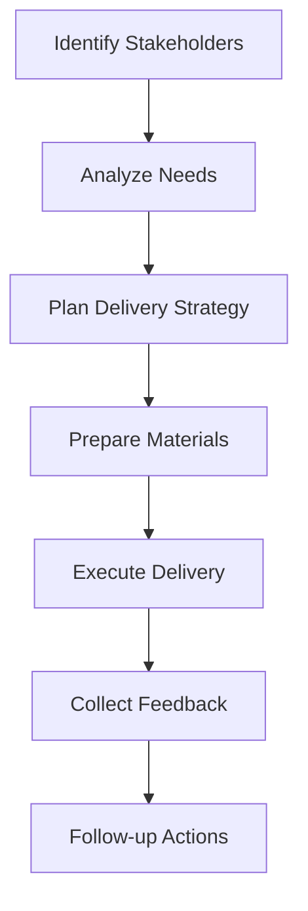

# 9.2 Deliver Report to Stakeholders

## Introduction

Delivering the loan approval prediction project report to stakeholders is a critical phase that requires careful planning, effective communication, and strategic presentation to ensure maximum impact and understanding. This process involves identifying key stakeholders, determining appropriate delivery methods, and establishing follow-up procedures to support implementation and ongoing engagement. This section provides comprehensive guidance on successful stakeholder delivery and communication strategies.

## Stakeholder Identification and Analysis

### 1. Primary Stakeholders
- **Executive Management:** CEOs, CFOs, and other C-level executives who make strategic decisions
- **Department Heads:** Managers responsible for loan operations, risk management, and compliance
- **Technical Teams:** Data scientists, IT professionals, and analysts who implement solutions
- **Regulatory Bodies:** Officials who oversee compliance and fair lending practices

### 2. Secondary Stakeholders
- **Board Members:** Directors who need high-level understanding of project outcomes
- **External Partners:** Vendors, consultants, and business partners
- **Industry Peers:** Colleagues in similar organizations who may benefit from insights
- **Academic Community:** Researchers and educators interested in methodology and findings

### 3. Stakeholder Characteristics
- **Technical Background:** Varying levels of technical expertise and understanding
- **Decision Authority:** Different levels of influence and decision-making power
- **Information Needs:** Specific requirements for different types of information
- **Communication Preferences:** Preferred delivery methods and formats

## Flowchart: Stakeholder Delivery Process

## Delivery Methods and Strategies

### 1. Executive Presentations
- **Board Meetings:** Formal presentations to board of directors
- **Executive Briefings:** One-on-one or small group sessions with senior leaders
- **Strategy Sessions:** Integration into strategic planning discussions
- **Quarterly Reviews:** Regular updates on implementation progress

### 2. Technical Workshops
- **Implementation Sessions:** Detailed technical discussions with implementation teams
- **Training Workshops:** Educational sessions for technical staff
- **Code Reviews:** Technical deep-dives into methodology and implementation
- **Best Practice Sharing:** Knowledge transfer sessions with technical teams

### 3. Regulatory Communications
- **Compliance Reviews:** Formal submissions to regulatory bodies
- **Fair Lending Audits:** Presentations to fair lending officers
- **Risk Assessment Reviews:** Discussions with risk management teams
- **Transparency Demonstrations:** Showcasing model explainability and interpretability

### 4. External Communications
- **Industry Conferences:** Presentations at professional conferences
- **Academic Publications:** Sharing findings with academic community
- **Partner Communications:** Updates to business partners and vendors
- **Public Relations:** Controlled external communications about project outcomes

## Communication Strategy Development

### 1. Message Tailoring
- **Executive Messages:** Focus on business impact, ROI, and strategic implications
- **Technical Messages:** Emphasize methodology, accuracy, and implementation details
- **Regulatory Messages:** Highlight compliance, fairness, and risk management
- **External Messages:** Balance transparency with confidentiality requirements

### 2. Presentation Formats
- **Executive Summary:** Concise overview for senior management
- **Technical Report:** Detailed documentation for technical teams
- **Implementation Guide:** Step-by-step instructions for deployment
- **Visual Dashboards:** Interactive presentations for different audiences

### 3. Delivery Timing
- **Strategic Timing:** Align with business cycles and decision-making periods
- **Staged Delivery:** Release information in phases to build understanding
- **Follow-up Schedule:** Plan ongoing communication and support
- **Milestone Updates:** Regular progress reports and status updates

## Delivery Execution

### 1. Pre-Delivery Preparation
- **Material Preparation:** Ensure all materials are ready and properly formatted
- **Technical Setup:** Test all presentation equipment and systems
- **Rehearsal:** Practice presentations and anticipate questions
- **Stakeholder Briefing:** Prepare stakeholders for what to expect

### 2. Delivery Execution
- **Professional Presentation:** Maintain high standards of presentation quality
- **Interactive Engagement:** Encourage questions and discussion
- **Flexible Approach:** Adapt to audience needs and feedback
- **Documentation:** Record key discussions and decisions

### 3. Post-Delivery Activities
- **Feedback Collection:** Gather immediate and follow-up feedback
- **Question Resolution:** Address questions and concerns promptly
- **Action Item Tracking:** Document and track follow-up actions
- **Relationship Building:** Strengthen relationships with key stakeholders

## Stakeholder-Specific Delivery Approaches

### 1. Executive Management Delivery
- **Format:** Executive summary with key visualizations
- **Focus:** Business impact, strategic implications, and recommendations
- **Duration:** 30-60 minute presentations with Q&A
- **Follow-up:** Regular progress updates and implementation support

### 2. Technical Team Delivery
- **Format:** Detailed technical documentation and code repositories
- **Focus:** Methodology, implementation details, and technical specifications
- **Duration:** Multi-day workshops and ongoing support
- **Follow-up:** Technical support and knowledge transfer

### 3. Regulatory Body Delivery
- **Format:** Formal compliance documentation and presentations
- **Focus:** Regulatory compliance, fairness, and risk management
- **Duration:** Formal review sessions and ongoing monitoring
- **Follow-up:** Regular compliance reporting and updates

### 4. External Stakeholder Delivery
- **Format:** Public summaries and controlled information sharing
- **Focus:** Industry insights and best practices
- **Duration:** Conference presentations and publications
- **Follow-up:** Ongoing collaboration and knowledge sharing

## Follow-up and Support Activities

### 1. Implementation Support
- **Technical Assistance:** Provide ongoing technical support for implementation
- **Training Programs:** Develop and deliver training for new processes
- **Documentation Updates:** Maintain current documentation and procedures
- **Troubleshooting:** Address implementation challenges and issues

### 2. Ongoing Communication
- **Progress Updates:** Regular status reports on implementation progress
- **Performance Monitoring:** Track and report on model performance
- **Stakeholder Engagement:** Maintain relationships and communication channels
- **Feedback Integration:** Incorporate stakeholder feedback into ongoing work

### 3. Knowledge Management
- **Documentation Maintenance:** Keep all documentation current and accessible
- **Best Practice Sharing:** Share lessons learned and best practices
- **Continuous Improvement:** Identify opportunities for ongoing enhancement
- **Success Stories:** Document and share successful implementations

## Success Metrics for Stakeholder Delivery

### 1. Communication Effectiveness
- **Understanding:** Stakeholders understand key messages and findings
- **Engagement:** High levels of stakeholder engagement and participation
- **Feedback Quality:** Positive and constructive feedback from stakeholders
- **Action Orientation:** Stakeholders take action based on findings

### 2. Implementation Success
- **Adoption Rate:** Successful adoption of recommendations and findings
- **Implementation Speed:** Timely implementation of key recommendations
- **Performance Improvement:** Measurable improvements in loan approval processes
- **Stakeholder Satisfaction:** High satisfaction with delivery and support

### 3. Relationship Building
- **Trust Development:** Building trust and credibility with stakeholders
- **Collaboration Enhancement:** Improved collaboration and communication
- **Future Opportunities:** Creating opportunities for future projects
- **Reputation Building:** Enhancing organizational reputation and expertise

## Common Challenges and Solutions

### 1. Stakeholder Resistance
- **Challenge:** Stakeholders may resist change or new approaches
- **Solution:** Provide clear evidence of benefits and address concerns
- **Approach:** Use change management techniques and stakeholder engagement
- **Strategy:** Demonstrate value and provide support for transition

### 2. Technical Complexity
- **Challenge:** Explaining complex technical concepts to non-technical audiences
- **Solution:** Use analogies, visualizations, and business language
- **Approach:** Provide multiple levels of detail for different audiences
- **Strategy:** Focus on business impact rather than technical details

### 3. Competing Priorities
- **Challenge:** Stakeholders may have competing priorities and limited attention
- **Solution:** Prioritize messages and focus on most important findings
- **Approach:** Align with stakeholder priorities and business objectives
- **Strategy:** Provide clear value proposition and implementation roadmap

### 4. Resource Constraints
- **Challenge:** Limited time and resources for comprehensive delivery
- **Solution:** Prioritize delivery based on stakeholder importance and impact
- **Approach:** Use efficient delivery methods and leverage technology
- **Strategy:** Focus on quality over quantity in delivery efforts

## Best Practices for Stakeholder Delivery

### 1. Preparation
- **Thorough Planning:** Develop comprehensive delivery plan
- **Stakeholder Analysis:** Understand needs and preferences of each stakeholder
- **Material Preparation:** Ensure all materials are ready and appropriate
- **Rehearsal:** Practice presentations and anticipate questions

### 2. Execution
- **Professional Presentation:** Maintain high standards of presentation quality
- **Flexible Approach:** Adapt to audience needs and feedback
- **Interactive Engagement:** Encourage questions and discussion
- **Clear Communication:** Use clear, accessible language

### 3. Follow-up
- **Prompt Response:** Address questions and concerns quickly
- **Ongoing Support:** Provide continued support and assistance
- **Feedback Integration:** Incorporate stakeholder feedback into ongoing work
- **Relationship Maintenance:** Maintain relationships with key stakeholders

## Conclusion

Successful stakeholder delivery is essential for maximizing the impact and value of loan approval prediction project findings. By carefully planning delivery strategies, tailoring communications to different audiences, and providing ongoing support, project teams can ensure that their work leads to meaningful improvements in lending practices and organizational success. 