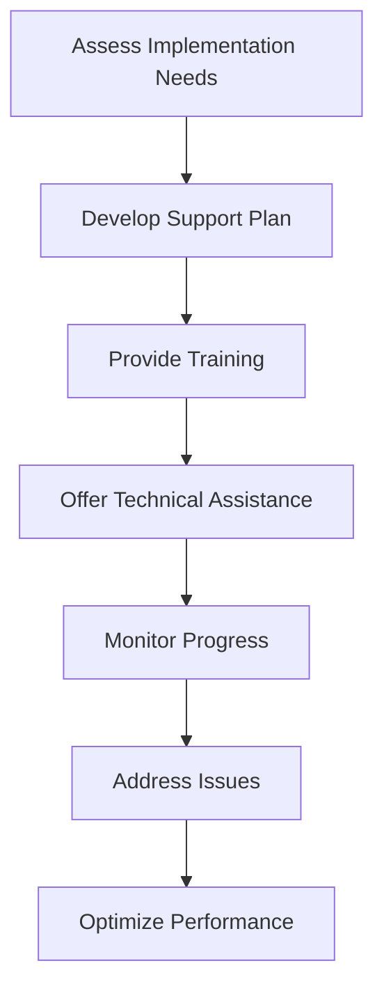

# 9.3 Provide Implementation Support

## Introduction

Implementation support is a critical component of successful loan approval prediction projects, ensuring that research findings and recommendations are effectively translated into operational improvements. This phase involves providing ongoing assistance, training, and guidance to help organizations successfully implement new processes, technologies, and methodologies. This section explores comprehensive strategies for providing effective implementation support that maximizes project impact and ensures sustainable improvements.

## Implementation Support Framework

### 1. Support Objectives
- **Knowledge Transfer:** Ensure understanding of new methodologies and processes
- **Technical Assistance:** Provide guidance on implementation challenges
- **Change Management:** Support organizational adaptation to new approaches
- **Performance Monitoring:** Track implementation success and outcomes

### 2. Support Phases
- **Pre-Implementation:** Planning and preparation support
- **Active Implementation:** Direct assistance during deployment
- **Post-Implementation:** Ongoing support and optimization
- **Long-term Maintenance:** Sustained support for continuous improvement

### 3. Support Levels
- **Strategic Support:** High-level guidance for executive decision-making
- **Tactical Support:** Operational assistance for implementation teams
- **Technical Support:** Detailed technical guidance and troubleshooting
- **User Support:** Training and assistance for end users

## Flowchart: Implementation Support Process

## Training and Education Programs

### 1. Executive Training
- **Strategic Overview:** High-level understanding of project implications
- **Business Impact:** Quantified benefits and strategic considerations
- **Risk Management:** Understanding of implementation risks and mitigation
- **Change Leadership:** Guidance on leading organizational change

### 2. Technical Training
- **Model Understanding:** Deep dive into predictive models and methodology
- **System Integration:** Technical implementation and integration guidance
- **Data Management:** Best practices for data handling and quality
- **Performance Monitoring:** Tools and techniques for ongoing monitoring

### 3. Operational Training
- **Process Changes:** New workflows and procedures
- **System Usage:** Training on new tools and technologies
- **Quality Assurance:** Methods for ensuring implementation quality
- **Troubleshooting:** Common issues and resolution strategies

### 4. User Training
- **End-User Education:** Training for staff who will use new systems
- **Best Practices:** Guidelines for optimal system usage
- **Support Resources:** Access to help and documentation
- **Feedback Mechanisms:** Channels for reporting issues and suggestions

## Technical Assistance and Guidance

### 1. Implementation Planning
- **Project Roadmap:** Detailed implementation timeline and milestones
- **Resource Allocation:** Guidance on required resources and personnel
- **Risk Assessment:** Identification and mitigation of implementation risks
- **Success Metrics:** Definition of success criteria and measurement methods

### 2. System Integration
- **Technical Architecture:** Guidance on system design and integration
- **Data Pipeline:** Support for data flow and processing setup
- **API Development:** Assistance with application programming interfaces
- **Testing Procedures:** Comprehensive testing and validation protocols

### 3. Performance Optimization
- **Model Tuning:** Optimization of model performance and accuracy
- **System Performance:** Monitoring and improvement of system efficiency
- **Scalability Planning:** Preparation for growth and increased usage
- **Maintenance Procedures:** Ongoing system maintenance and updates

### 4. Troubleshooting Support
- **Issue Resolution:** Rapid response to technical problems
- **Root Cause Analysis:** Systematic investigation of issues
- **Solution Development:** Creation of effective problem solutions
- **Prevention Strategies:** Proactive measures to prevent future issues

## Change Management Support

### 1. Organizational Change
- **Stakeholder Engagement:** Strategies for involving key stakeholders
- **Communication Planning:** Effective communication of changes
- **Resistance Management:** Addressing concerns and resistance
- **Success Stories:** Sharing examples of successful implementations

### 2. Process Improvement
- **Workflow Optimization:** Streamlining existing processes
- **Quality Enhancement:** Improving accuracy and efficiency
- **Compliance Integration:** Ensuring regulatory compliance
- **Continuous Improvement:** Establishing ongoing improvement cycles

### 3. Culture Change
- **Data-Driven Culture:** Promoting evidence-based decision making
- **Innovation Mindset:** Encouraging adoption of new approaches
- **Collaboration Enhancement:** Improving cross-functional cooperation
- **Learning Organization:** Building capacity for ongoing learning

## Monitoring and Evaluation Support

### 1. Performance Monitoring
- **Key Metrics:** Definition and tracking of performance indicators
- **Dashboard Development:** Creation of monitoring dashboards
- **Alert Systems:** Automated notifications for performance issues
- **Reporting Procedures:** Regular performance reporting and analysis

### 2. Quality Assurance
- **Quality Standards:** Establishment of quality criteria and standards
- **Audit Procedures:** Regular audits of implementation quality
- **Compliance Monitoring:** Ongoing compliance verification
- **Continuous Assessment:** Regular evaluation of implementation effectiveness

### 3. Feedback Collection
- **User Feedback:** Gathering input from system users
- **Stakeholder Input:** Collecting feedback from key stakeholders
- **Performance Data:** Analyzing system and process performance
- **Improvement Suggestions:** Identifying opportunities for enhancement

## Ongoing Support Activities

### 1. Help Desk Support
- **Technical Support:** Direct assistance for technical issues
- **User Support:** Help for end users with system questions
- **Documentation:** Comprehensive documentation and user guides
- **Knowledge Base:** Searchable repository of solutions and answers

### 2. Regular Maintenance
- **System Updates:** Regular software and system updates
- **Performance Tuning:** Ongoing optimization of system performance
- **Security Updates:** Implementation of security patches and improvements
- **Backup and Recovery:** Ensuring data protection and system recovery

### 3. Continuous Improvement
- **Performance Analysis:** Regular analysis of system performance
- **User Feedback Integration:** Incorporating user feedback into improvements
- **Best Practice Updates:** Updating procedures based on lessons learned
- **Innovation Integration:** Incorporating new technologies and approaches

## Success Metrics for Implementation Support

### 1. Implementation Success
- **Adoption Rate:** Percentage of target users adopting new systems
- **Performance Improvement:** Measurable improvements in key metrics
- **User Satisfaction:** High satisfaction levels among users
- **Timeline Adherence:** Meeting implementation timelines and milestones

### 2. Support Effectiveness
- **Response Time:** Speed of support response to issues
- **Resolution Rate:** Percentage of issues successfully resolved
- **User Confidence:** User confidence in system reliability and support
- **Knowledge Transfer:** Successful transfer of knowledge to internal teams

### 3. Business Impact
- **Process Efficiency:** Improvements in operational efficiency
- **Cost Reduction:** Measurable cost savings from implementation
- **Quality Enhancement:** Improvements in accuracy and quality
- **Risk Reduction:** Reduction in operational and compliance risks

## Common Implementation Challenges and Solutions

### 1. Technical Challenges
- **System Integration:** Complex integration with existing systems
- **Data Quality:** Issues with data accuracy and completeness
- **Performance Issues:** System performance and scalability problems
- **Security Concerns:** Data security and privacy protection

### 2. Organizational Challenges
- **Resistance to Change:** Employee resistance to new processes
- **Resource Constraints:** Limited time, budget, or personnel
- **Communication Gaps:** Poor communication about changes
- **Training Needs:** Insufficient training and education

### 3. Operational Challenges
- **Process Complexity:** Overly complex implementation procedures
- **Quality Assurance:** Difficulty maintaining quality standards
- **Compliance Issues:** Regulatory compliance challenges
- **Monitoring Gaps:** Insufficient monitoring and evaluation

## Best Practices for Implementation Support

### 1. Proactive Support
- **Early Engagement:** Begin support activities early in the process
- **Comprehensive Planning:** Develop detailed support plans
- **Risk Mitigation:** Identify and address potential issues early
- **Continuous Monitoring:** Ongoing monitoring and assessment

### 2. Collaborative Approach
- **Stakeholder Involvement:** Engage all relevant stakeholders
- **Team Collaboration:** Foster collaboration among implementation teams
- **Knowledge Sharing:** Promote sharing of best practices and lessons learned
- **Partnership Development:** Build strong partnerships with key stakeholders

### 3. Quality Focus
- **High Standards:** Maintain high standards for implementation quality
- **Continuous Improvement:** Regular assessment and improvement of processes
- **Best Practice Adoption:** Incorporate industry best practices
- **Innovation Integration:** Stay current with new technologies and approaches

## Conclusion

Effective implementation support is essential for ensuring that loan approval prediction project findings translate into meaningful organizational improvements. By providing comprehensive training, technical assistance, and ongoing support, project teams can maximize the impact of their work and ensure sustainable improvements in lending practices and organizational performance. 