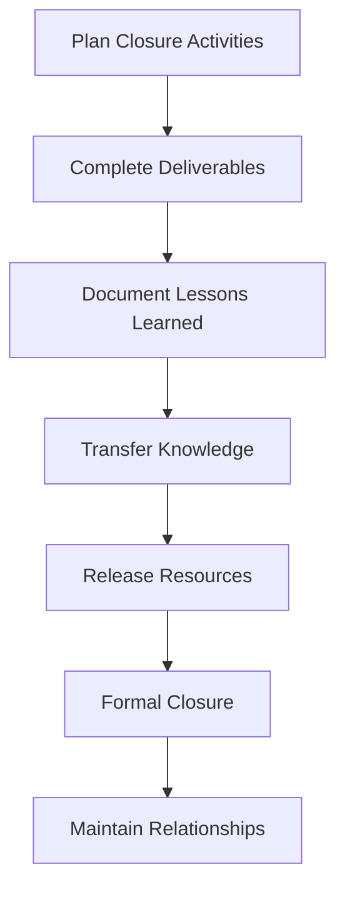

# 9.4 Close Project

## Introduction

Project closure is the final phase of a loan approval prediction project, marking the formal completion of all project activities and the transition to ongoing operations. This critical phase involves systematically wrapping up all project activities, documenting lessons learned, ensuring knowledge transfer, and formally closing the project while maintaining relationships and support for ongoing implementation. This section provides comprehensive guidance on effective project closure that ensures lasting impact and organizational learning.

## Project Closure Framework

### 1. Closure Objectives
- **Formal Completion:** Officially close all project activities and deliverables
- **Knowledge Preservation:** Document all project knowledge and lessons learned
- **Resource Release:** Release project resources and personnel
- **Relationship Maintenance:** Maintain relationships for ongoing support
- **Success Celebration:** Recognize project achievements and team contributions

### 2. Closure Phases
- **Pre-Closure Planning:** Preparation for systematic project closure
- **Active Closure:** Execution of closure activities and deliverables
- **Post-Closure Activities:** Ongoing support and relationship maintenance
- **Lessons Learned:** Documentation and sharing of project insights

### 3. Closure Components
- **Administrative Closure:** Formal project completion procedures
- **Technical Closure:** Finalization of technical deliverables
- **Stakeholder Closure:** Communication and relationship management
- **Organizational Closure:** Integration of project outcomes into operations

## Flowchart: Project Closure Process

## Administrative Closure Activities

### 1. Project Documentation
- **Final Report Compilation:** Complete all project documentation
- **Deliverable Verification:** Ensure all deliverables are complete and accepted
- **Contract Closure:** Finalize all contracts and agreements
- **Financial Closure:** Complete all financial transactions and reporting

### 2. Resource Management
- **Personnel Release:** Release project team members to other assignments
- **Equipment Return:** Return or dispose of project equipment
- **Budget Closure:** Finalize all budget items and financial reporting
- **Space Management:** Release project workspace and facilities

### 3. Administrative Procedures
- **Project Archive:** Create comprehensive project archive
- **Documentation Storage:** Store all project documents securely
- **Access Management:** Manage access to project materials and systems
- **Compliance Verification:** Ensure all regulatory and policy compliance

## Technical Closure Activities

### 1. Deliverable Finalization
- **Model Deployment:** Ensure predictive models are fully deployed
- **System Integration:** Complete all system integrations
- **Documentation Completion:** Finalize all technical documentation
- **Testing Completion:** Complete all testing and validation activities

### 2. Knowledge Transfer
- **Technical Documentation:** Complete comprehensive technical documentation
- **Training Completion:** Ensure all training activities are completed
- **Support Handover:** Transfer ongoing support responsibilities
- **Best Practice Sharing:** Document and share technical best practices

### 3. Quality Assurance
- **Final Quality Review:** Conduct comprehensive quality review
- **Performance Validation:** Validate final system performance
- **Compliance Verification:** Ensure regulatory compliance
- **Security Review:** Complete security and privacy reviews

## Stakeholder Closure Activities

### 1. Communication Management
- **Final Status Report:** Provide comprehensive final project status
- **Achievement Recognition:** Recognize project achievements and contributions
- **Future Planning:** Discuss ongoing implementation and support
- **Relationship Maintenance:** Establish ongoing communication channels

### 2. Stakeholder Engagement
- **Executive Briefing:** Final briefing to senior management
- **Team Recognition:** Recognize team contributions and achievements
- **Partner Communication:** Communicate with external partners and vendors
- **User Feedback:** Collect final feedback from end users

### 3. Relationship Management
- **Ongoing Support:** Establish ongoing support relationships
- **Future Collaboration:** Identify opportunities for future collaboration
- **Knowledge Sharing:** Share project insights with broader organization
- **Network Building:** Maintain professional networks and relationships

## Lessons Learned Documentation

### 1. Project Success Factors
- **Key Success Factors:** Document what contributed to project success
- **Best Practices:** Identify and document best practices
- **Innovation Highlights:** Document innovative approaches and solutions
- **Team Performance:** Recognize outstanding team contributions

### 2. Challenges and Solutions
- **Major Challenges:** Document significant challenges encountered
- **Solution Strategies:** Describe how challenges were addressed
- **Risk Management:** Document risk mitigation strategies
- **Problem Resolution:** Record problem-solving approaches

### 3. Process Improvements
- **Methodology Insights:** Document lessons about research methodology
- **Technical Approaches:** Share insights about technical approaches
- **Stakeholder Management:** Document stakeholder management lessons
- **Communication Strategies:** Record effective communication approaches

### 4. Organizational Learning
- **Capability Development:** Document new organizational capabilities
- **Knowledge Gaps:** Identify areas for future development
- **Resource Requirements:** Document resource needs and availability
- **Infrastructure Insights:** Share insights about technical infrastructure

## Knowledge Transfer and Preservation

### 1. Documentation Strategy
- **Comprehensive Documentation:** Create complete project documentation
- **Knowledge Repository:** Establish accessible knowledge repository
- **Best Practice Library:** Create library of best practices and lessons
- **Reference Materials:** Develop reference materials for future projects

### 2. Training and Education
- **Training Materials:** Develop comprehensive training materials
- **Knowledge Sharing:** Conduct knowledge sharing sessions
- **Mentoring Programs:** Establish mentoring for ongoing support
- **Continuous Learning:** Promote ongoing learning and development

### 3. Organizational Integration
- **Process Integration:** Integrate new processes into operations
- **Policy Updates:** Update organizational policies and procedures
- **Capability Building:** Build organizational capabilities
- **Culture Change:** Support organizational culture change

## Success Metrics for Project Closure

### 1. Closure Completeness
- **Deliverable Completion:** All deliverables completed and accepted
- **Documentation Quality:** Comprehensive and high-quality documentation
- **Knowledge Transfer:** Successful transfer of knowledge and capabilities
- **Resource Release:** Efficient release of project resources

### 2. Stakeholder Satisfaction
- **Executive Satisfaction:** Senior management satisfaction with outcomes
- **Team Satisfaction:** Project team satisfaction with closure process
- **User Satisfaction:** End-user satisfaction with deliverables
- **Partner Satisfaction:** External partner satisfaction with collaboration

### 3. Organizational Impact
- **Capability Development:** New organizational capabilities established
- **Process Improvement:** Measurable improvements in processes
- **Knowledge Preservation:** Effective preservation of project knowledge
- **Future Readiness:** Organization prepared for future similar projects

## Common Closure Challenges and Solutions

### 1. Incomplete Deliverables
- **Challenge:** Some deliverables may not be fully complete
- **Solution:** Prioritize critical deliverables and plan for completion
- **Approach:** Document incomplete items and create completion plans
- **Strategy:** Establish clear acceptance criteria and timelines

### 2. Knowledge Loss
- **Challenge:** Risk of losing critical project knowledge
- **Solution:** Comprehensive documentation and knowledge transfer
- **Approach:** Multiple knowledge transfer methods and formats
- **Strategy:** Establish ongoing knowledge management processes

### 3. Stakeholder Disengagement
- **Challenge:** Stakeholders may disengage during closure
- **Solution:** Maintain active stakeholder communication and engagement
- **Approach:** Regular updates and involvement in closure activities
- **Strategy:** Establish ongoing relationship management

### 4. Resource Constraints
- **Challenge:** Limited resources for comprehensive closure
- **Solution:** Prioritize closure activities based on importance
- **Approach:** Efficient resource allocation and planning
- **Strategy:** Leverage existing resources and capabilities

## Best Practices for Project Closure

### 1. Systematic Approach
- **Comprehensive Planning:** Develop detailed closure plan
- **Stakeholder Involvement:** Involve all relevant stakeholders
- **Quality Focus:** Maintain high standards throughout closure
- **Documentation Emphasis:** Prioritize comprehensive documentation

### 2. Communication Excellence
- **Clear Communication:** Maintain clear and consistent communication
- **Stakeholder Engagement:** Keep stakeholders engaged throughout closure
- **Achievement Recognition:** Recognize and celebrate achievements
- **Future Planning:** Discuss ongoing implementation and support

### 3. Knowledge Management
- **Comprehensive Documentation:** Create complete project documentation
- **Knowledge Transfer:** Ensure effective knowledge transfer
- **Best Practice Sharing:** Share best practices and lessons learned
- **Continuous Learning:** Promote ongoing learning and development

## Post-Closure Activities

### 1. Ongoing Support
- **Technical Support:** Provide ongoing technical support as needed
- **User Support:** Continue user support and assistance
- **Performance Monitoring:** Monitor ongoing performance and outcomes
- **Continuous Improvement:** Support ongoing improvement efforts

### 2. Relationship Maintenance
- **Stakeholder Communication:** Maintain communication with key stakeholders
- **Network Building:** Continue building professional networks
- **Collaboration Opportunities:** Identify future collaboration opportunities
- **Knowledge Sharing:** Continue sharing knowledge and insights

### 3. Organizational Learning
- **Lessons Learned Integration:** Integrate lessons learned into organizational processes
- **Best Practice Adoption:** Adopt best practices across organization
- **Capability Development:** Continue developing organizational capabilities
- **Innovation Promotion:** Promote innovation and continuous improvement

## Conclusion

Effective project closure is essential for ensuring that loan approval prediction projects deliver lasting value and organizational learning. By conducting systematic closure activities, documenting lessons learned, and maintaining relationships, project teams can ensure that their work continues to provide value long after the formal project completion while building organizational capabilities for future success. 